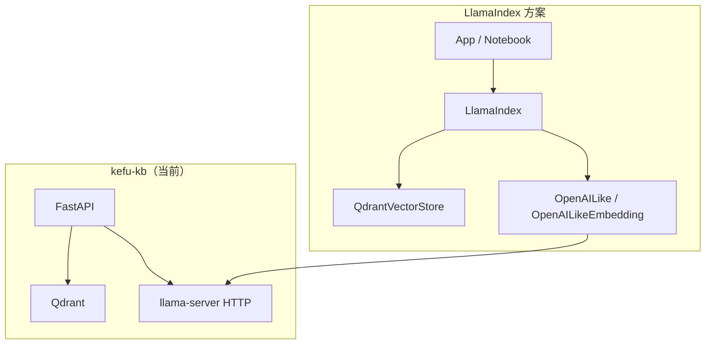

# 13 - llama.cpp / llama-server 集成

## 背景

本仓库 `03-推理部署/llama.cpp` 提供 **llama-server**，暴露 OpenAI 兼容 HTTP API：

- `/v1/chat/completions` — 对话
- `/v1/embeddings` — 向量
- rerank 端点（视构建配置）

`07-业务应用/kefu-kb` 已直接 HTTP 调用这些 API。LlamaIndex 可通过 **OpenAILike** 系列集成无缝对接，无需 Python llama-cpp binding。

## 架构对比



| 维度 | kefu-kb | LlamaIndex + OpenAILike |
|------|---------|-------------------------|
| 编排 | 手写 ingest/retriever/chat | VectorStoreIndex + QueryEngine |
| 向量库 | qdrant-client | QdrantVectorStore |
| LLM | httpx → llama-server | OpenAILike |
| 多轮 | 无 | ChatEngine |
| 依赖 | 轻量 | llama-index-core + 集成包 |

## 依赖安装

```bash
pip install llama-index-core
pip install llama-index-llms-openai-like
pip install llama-index-embeddings-openai-like
pip install llama-index-vector-stores-qdrant
```

## 完整示例

### 1. 启动 llama-server

```bash
cd /home/cp/work2/largeModels/03-推理部署/llama.cpp

# Chat
./build/bin/llama-server \
  -m /path/to/Qwen2.5-7B-Instruct-Q4_K_M.gguf \
  --port 8080

# Embedding（另开终端或合并部署）
./build/bin/llama-server \
  -m /path/to/bge-m3.gguf \
  --embedding \
  --port 8081
```

### 2. 配置 Settings

```python
from llama_index.core import Settings
from llama_index.llms.openai_like import OpenAILike
from llama_index.embeddings.openai_like import OpenAILikeEmbedding
from llama_index.core.node_parser import SentenceSplitter

Settings.llm = OpenAILike(
    model="Qwen2.5-7B-Instruct",
    api_base="http://127.0.0.1:8080/v1",
    api_key="not-needed",
    is_chat_model=True,
    context_window=8192,
    temperature=0.1,
)

Settings.embed_model = OpenAILikeEmbedding(
    model_name="bge-m3",
    api_base="http://127.0.0.1:8081/v1",
    api_key="not-needed",
    embed_batch_size=8,
)

Settings.node_parser = SentenceSplitter(chunk_size=512, chunk_overlap=64)
```

### 3. 使用 Qdrant（与 kefu-kb 共用）

```python
import qdrant_client
from llama_index.core import VectorStoreIndex, SimpleDirectoryReader, StorageContext
from llama_index.vector_stores.qdrant import QdrantVectorStore

client = qdrant_client.QdrantClient(host="localhost", port=6333)
vector_store = QdrantVectorStore(
    client=client,
    collection_name="kefu_kb_li",  # 可与 kefu-kb 分 collection
)

documents = SimpleDirectoryReader(
    "/home/cp/work2/largeModels/07-业务应用/kefu-kb/data/docs"
).load_data()

storage_context = StorageContext.from_defaults(vector_store=vector_store)
index = VectorStoreIndex.from_documents(
    documents,
    storage_context=storage_context,
    show_progress=True,
)
```

### 4. 查询

```python
from llama_index.core import PromptTemplate

qa_prompt = PromptTemplate(
    """你是电商客服。仅根据以下资料回答，不知道请说「暂无相关信息」。

资料：
{context_str}

问题：{query_str}

回答："""
)

query_engine = index.as_query_engine(
    similarity_top_k=5,
    text_qa_template=qa_prompt,
    response_mode="compact",
)

response = query_engine.query("退货要在多少天内申请？")
print(response)
for n in response.source_nodes:
    print(f"  [{n.score:.3f}] {n.metadata.get('file_name')}")
```

### 5. 多轮客服

```python
chat_engine = index.as_chat_engine(
    chat_mode="condense_plus_context",
    similarity_top_k=5,
    system_prompt="你是电商客服助手。",
)

r1 = chat_engine.chat("退货政策是什么？")
r2 = chat_engine.chat("需要运费吗？")
```

## OpenAILike 源码要点

`OpenAILike` 继承 `OpenAI`，重写默认 `api_base`：

```python
# llama_index/llms/openai_like/base.py
class OpenAILike(OpenAI):
    """
    thin wrapper around the OpenAI model that makes it compatible with
    3rd party tools that provide an openai-compatible api.
    """
```

关键参数：

| 参数 | llama-server 建议 |
|------|-------------------|
| `api_base` | `http://host:port/v1` |
| `api_key` | 任意非空（server 不校验时） |
| `is_chat_model` | `True` |
| `context_window` | 与 GGUF 模型一致 |
| `max_tokens` | 512–1024 客服场景 |

Embedding 同理，`OpenAILikeEmbedding` 继承 `OpenAIEmbedding`，指定 `api_base` 即可。

## 其他 llama.cpp 集成方式

### LlamaCPP（Python binding）

```bash
pip install llama-index-llms-llama-cpp
```

```python
from llama_index.llms.llama_cpp import LlamaCPP

llm = LlamaCPP(model_path="/path/to/model.gguf", verbose=False)
```

- **优点**：无 HTTP 开销，单进程
- **缺点**：与 kefu-kb / llama-server 架构不一致，不易多模型路由

### Ollama

```python
from llama_index.llms.ollama import Ollama
llm = Ollama(model="llama3.1", base_url="http://localhost:11434")
```

## Rerank

llama-server 若启用 rerank 模型，可编写自定义 Postprocessor：

```python
from llama_index.core.postprocessor.types import BaseNodePostprocessor
import httpx

class LlamaServerRerank(BaseNodePostprocessor):
    def _postprocess_nodes(self, nodes, query_bundle):
        # POST rerank API，按返回分数重排
        ...
```

或在检索时增大 `similarity_top_k`，依赖 `compact` synthesizer 压缩 context。

## 从 kefu-kb 迁移 checklist

- [ ] 安装 llama-index + qdrant + openai-like 集成
- [ ] `Settings` 对齐 `config.yaml` 端口与模型名
- [ ] `SimpleDirectoryReader` 替换手写文件遍历
- [ ] `QdrantVectorStore` 替换 `qdrant-client` 直接操作
- [ ] `as_query_engine` 替换 `app/rag.py` 中 prompt 拼接
- [ ] 可选：`as_chat_engine` 实现多轮
- [ ] FastAPI 路由可保留，内部改为调用 QueryEngine

## 相关文档

- llama.cpp 推理：`03-推理部署/llama.cppDoc/`
- kefu-kb 业务：`07-业务应用/kefu-kb/README.md`
- LlamaIndex 集成模式：[11-integrations.md](./11-integrations.md)
