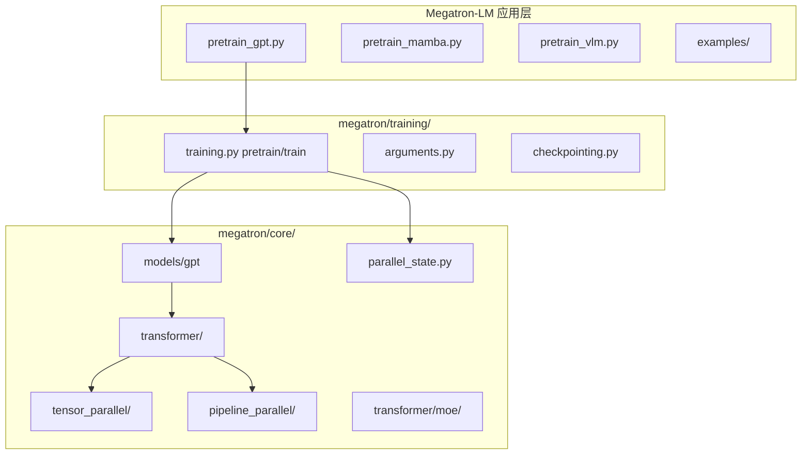

# 01 - 项目总览

## 双组件架构

Megatron 仓库包含两个层次：

| 组件 | 定位 | 用户 |
|------|------|------|
| **Megatron Core** | GPU 优化可组合库 | 框架开发者、ML 工程师 |
| **Megatron-LM** | 参考实现 + 训练脚本 | 研究团队、学习分布式训练 |



## 版本与规模

| 指标 | 值 |
|------|-----|
| 发布版本 | 0.15.0 |
| 仓库文件 | ~2770+ |
| megatron/ | ~555 Python 模块 |
| 扩展规模 | 2B–462B 参数，6144 H100 |
| MFU | 41%–48%（weak scaling） |

## 目录结构（官方）

```
Megatron-LM/
├── megatron/
│   ├── core/                    # Megatron Core
│   │   ├── models/              # GPT、T5、Vision 等
│   │   ├── transformer/         # Attention、MLP、MoE、MLA
│   │   ├── tensor_parallel/     # TP 层与映射
│   │   ├── pipeline_parallel/   # PP 调度与 P2P
│   │   ├── distributed/         # DDP、FSDP
│   │   ├── optimizer/           # 分布式优化器
│   │   ├── datasets/            # Megatron 数据集
│   │   ├── dist_checkpointing/  # 分片 checkpoint
│   │   ├── inference/           # 推理引擎
│   │   └── export/              # TensorRT-LLM 等导出
│   ├── training/                # 训练主循环
│   ├── legacy/                  # 旧版组件
│   ├── post_training/           # ModelOpt 量化等
│   ├── rl/                      # Megatron-RL
│   └── elastification/          # Flextron 弹性训练
├── pretrain_gpt.py              # 主入口
├── pretrain_mamba.py
├── pretrain_hybrid.py
├── pretrain_vlm.py
├── train_rl.py
├── examples/                    # 按模型/任务分类示例
├── tools/                       # 预处理、checkpoint 工具
├── tests/                       # 单元 + 功能测试
└── docs/                        # 官方文档源
```

## 顶层入口脚本

| 脚本 | 用途 |
|------|------|
| `pretrain_gpt.py` | GPT 预训练 / SFT / FIM |
| `pretrain_mamba.py` | Mamba 架构预训练 |
| `pretrain_hybrid.py` | Transformer-Mamba 混合 |
| `pretrain_vlm.py` | 视觉-语言多模态 |
| `train_rl.py` | RL 后训练 |

## 依赖与安装

```bash
# PyPI
uv pip install megatron-core

# 源码
git clone https://github.com/NVIDIA/Megatron-LM.git
cd Megatron-LM
uv pip install -e .
# 内存不足时: MAX_JOBS=4 uv pip install -e .
```

**关键依赖**：

- PyTorch + NCCL（多 GPU）
- **Transformer Engine**（TE）：FP8、融合 kernel、可选
- `einops`、datasets、各类 NVIDIA 库

## 设计原则（从代码归纳）

1. **ModuleSpec 组合**：层实现通过 spec 注入，支持 TE / local / inference_optimized
2. **parallel_state (mpu)**：全局 process group，正在迁移到 `ProcessGroupCollection`
3. **Microbatch 调度**：global batch = micro_batch × num_microbatches × DP
4. **Dist Checkpoint**：按 TP/PP/EP 分片存储，支持 async save
5. **Config dataclass**：`TransformerConfig` 集中数百个训练/模型参数

## 支持的模型与特性（节选）

| 类别 | 支持 |
|------|------|
| 架构 | GPT、T5、BERT、ViT、Mamba、Hybrid、VLM |
| 注意力 | MHA、GQA、MLA、DSA、Linear variant |
| MoE | DeepSeek-V2/V3、Qwen3、Mixtral |
| 精度 | FP16、BF16、FP8、FP4 |
| 并行 | TP、PP、DP、EP、CP、VPP、SP |
| 优化 | Distributed Optimizer、Muon、CUDA Graph |

## 相关外部项目

| 项目 | 作用 |
|------|------|
| [Megatron Bridge](https://github.com/NVIDIA-NeMo/Megatron-Bridge) | HF ↔ Megatron 权重转换 + recipes |
| [NeMo RL](https://github.com/NVIDIA-NeMo/RL) | 企业级 RL 后训练 |
| [Emerging-Optimizers](https://github.com/NVIDIA-NeMo/Emerging-Optimizers) | Muon 等优化器 |

## 与本仓库路径

```
/home/cp/work2/largeModels/06-Research/Megatron-LM/
```

文档输出：

```
/home/cp/work2/largeModels/06-Research/Megatron-LMDoc/
```
