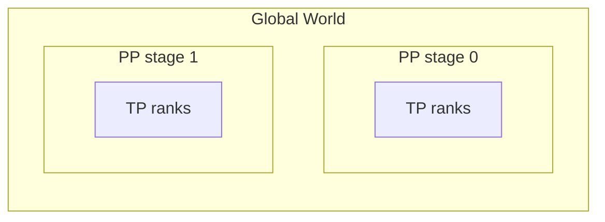

# 02 - 架构与训练数据流

## 端到端训练流

```mermaid
sequenceDiagram
    participant Main as pretrain_gpt.py
    participant Init as initialize.py
    participant MPU as parallel_state
    participant Data as GPTDataset
    participant Model as GPTModel
    participant Sched as pipeline schedules
    participant Opt as DistributedOptimizer

    Main->>Init: parse_and_validate_args
    Init->>MPU: initialize_model_parallel
    Main->>Main: pretrain()
    Main->>Model: model_provider / gpt_builder
    Main->>Data: BlendedMegatronDatasetBuilder
    loop each iteration
        Main->>Main: get_batch(data_iterator)
        Main->>Sched: forward_backward_func
        Sched->>Model: forward_step
        Sched->>Opt: backward + allreduce grads
        Main->>Opt: optimizer.step()
    end
```

## 分层职责

| 层 | 路径 | 职责 |
|----|------|------|
| 入口 | `pretrain_*.py` | 定义 `forward_step`、`get_batch`、dataset provider |
| 训练框架 | `megatron/training/` | `pretrain()`、`train()`、`train_step()` |
| 模型 | `megatron/core/models/` | `GPTModel`、embedding、output head |
| 变换块 | `megatron/core/transformer/` | Layer、Attention、MoE、MLA |
| 并行 | `core/tensor_parallel/`、`pipeline_parallel/` | 切分、通信、调度 |
| 状态 | `core/parallel_state.py` | Process group 初始化与查询 |
| 数据 | `core/datasets/` | Indexed binary、blended、mock |
| 持久化 | `training/checkpointing.py` + `dist_checkpointing/` | save/load |

## pretrain() 生命周期

`megatron/training/training.py` 中 `pretrain()` 主要阶段：

1. **初始化**：分布式、参数、tokenizer、timer、wandb
2. **构建模型**：`model_provider` → 可能多 virtual pipeline chunk
3. **包装 DDP/FSDP**：`DistributedDataParallel` 或 `megatron_FSDP`
4. **优化器**：`get_megatron_optimizer` + DistributedOptimizer（ZeRO-1 类）
5. **数据**：`train_valid_test_dataset_provider` 构建 iterator
6. **Checkpoint**：load 或随机初始化
7. **train() 循环**：`train_step` → log → validate → save
8. **收尾**：final checkpoint、metrics

## train_step() 核心

单次迭代（简化）：

```python
# training.py — 概念流程
while rerun_state_machine.should_run_forward_backward(...):
    zero_grad_buffer(model)
    losses_reduced = forward_backward_func(
        forward_step_func, data_iterator, model,
        num_microbatches=get_num_microbatches(),
        ...
    )
optimizer.step()
lr_scheduler.step()
```

`forward_backward_func` 来自 pipeline schedule（1F1B、interleaved 等）。

## forward_step（pretrain_gpt.py）

GPT 训练的 forward 通常：

1. `get_batch()` 取 tokens、labels、loss_mask、position_ids
2. 可选 CP/TP 切分 batch
3. `model(tokens, position_ids, attention_mask, labels=...)`
4. 计算 language modeling loss（含 MTP auxiliary loss）
5. 返回 loss tensor 供 schedule 反传

## 进程组与 rank 布局

`initialize_model_parallel()` 默认 order：`tp-cp-ep-dp-pp`



- **TP**：切单层权重（Column/Row Parallel Linear）
- **PP**：切层深度，stage 间 P2P 传 activation
- **DP**：复制模型，不同数据，梯度 allreduce
- **EP**：MoE expert 切分到不同 GPU
- **CP**：长序列 context 维切分

总 GPU 数 ≈ TP × PP × DP × CP × EP（具体组合见配置）。

## Config 流

```
CLI args (arguments.py)
    → TransformerConfig (core/transformer/transformer_config.py)
    → GPTModelConfig (training/models/gpt.py)
    → PretrainConfigContainer
```

`TransformerConfig` 继承 `ModelParallelConfig`，包含并行度、重计算、FP8、MoE、MTP 等 **数百字段**。

## ModuleSpec 模式

层实现不硬编码，通过 spec 选择：

```python
# training/models/gpt.py — default_layer_spec
if transformer_impl == "transformer_engine":
    return get_gpt_layer_with_transformer_engine_spec(...)
elif transformer_impl == "inference_optimized":
    return get_gpt_layer_with_inference_spec(...)
else:
    return get_gpt_layer_local_spec(...)
```

便于切换 TE 融合 kernel vs 纯 PyTorch local 实现。

## 与 beyond-nanogpt 对照

| 概念 | beyond-nanogpt | Megatron-LM |
|------|----------------|-------------|
| 训练入口 | 单文件 `train_*.py` | `pretrain()` + 插件式 provider |
| 并行 | 手写 DDP/TP | TP+PP+DP+EP+CP 全栈 |
| Batch | DataLoader v2 | microbatch + global batch calculator |
| 模型 | 单 GPT 类 | GPTModel + ModuleSpec + TE |

## 关键源码入口

| 功能 | 文件 |
|------|------|
| 训练主函数 | `megatron/training/training.py` |
| GPT 入口 | `pretrain_gpt.py` |
| 并行初始化 | `megatron/core/parallel_state.py` |
| GPT 模型 | `megatron/core/models/gpt/gpt_model.py` |
| 配置 | `megatron/core/transformer/transformer_config.py` |
