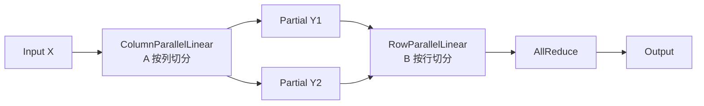

# 03 - 并行策略（Parallelism）

源码核心：`megatron/core/parallel_state.py`、`tensor_parallel/`、`pipeline_parallel/`、`distributed/`

## 五维并行一览

| 缩写 | 名称 | 切分维度 | 典型用途 |
|------|------|----------|----------|
| **TP** | Tensor Parallel | 单层权重/激活 | 大层放不进单卡 |
| **PP** | Pipeline Parallel | 层深度（stage） | 超深模型 |
| **DP** | Data Parallel | 数据 batch | 扩大 global batch |
| **EP** | Expert Parallel | MoE expert | 专家分布在多卡 |
| **CP** | Context Parallel | 序列长度 | 长上下文训练 |

另有：

- **SP**（Sequence Parallel）：与 TP 结合，切 sequence 维激活
- **VPP**（Virtual Pipeline Parallel）：单 stage 内交错多 microbatch，减 bubble
- **ETP**（Expert Tensor Parallel）：专家内部 TP

## initialize_model_parallel

```python
# parallel_state.py — 主要参数
initialize_model_parallel(
    tensor_model_parallel_size=1,
    pipeline_model_parallel_size=1,
    virtual_pipeline_model_parallel_size=None,
    context_parallel_size=1,
    expert_model_parallel_size=1,
    expert_tensor_parallel_size=None,
    order="tp-cp-ep-dp-pp",
    ...
)
```

**Process group 全局变量**（节选）：

| 变量 | 含义 |
|------|------|
| `_TENSOR_MODEL_PARALLEL_GROUP` | 层内 TP |
| `_PIPELINE_MODEL_PARALLEL_GROUP` | PP stage |
| `_DATA_PARALLEL_GROUP` | DP |
| `_EXPERT_MODEL_PARALLEL_GROUP` | MoE EP |
| `_EXPERT_TENSOR_PARALLEL_GROUP` | MoE ETP |
| `_EMBEDDING_GROUP` | embedding 复制/广播 |

查询 API：`get_tensor_model_parallel_rank()`、`get_pipeline_model_parallel_rank()` 等。

**迁移方向**：Core 新代码应传入 `ProcessGroupCollection`，少直接读 global mpu（见 `AGENTS.md`）。

## Tensor Parallel（TP）

路径：`megatron/core/tensor_parallel/`

### 核心文件

| 文件 | 内容 |
|------|------|
| `layers.py` | `ColumnParallelLinear`、`RowParallelLinear`、`VocabParallelEmbedding` |
| `mappings.py` | scatter/gather/reduce 区域映射 |
| `cross_entropy.py` | 并行 vocab 上的 CE |
| `random.py` | TP 一致 RNG |

### Column vs Row Parallel



- **ColumnParallel**：输出按列分片，常配合 **RowParallel** + allreduce
- **Attention**：QKV projection 列并行，输出 projection 行并行

### Sequence Parallel

激活在 sequence 维切分，配合 `reduce_scatter_to_sequence_parallel_region` 等，降低 activation memory。

## Pipeline Parallel（PP）

路径：`megatron/core/pipeline_parallel/`

| 文件 | 内容 |
|------|------|
| `schedules.py` | 1F1B、interleaved 1F1B 等 forward-backward 调度 |
| `p2p_communication.py` | stage 间 send/recv activation |
| `combined_1f1b.py` | 1F1B 组合实现 |
| `fine_grained_activation_offload.py` | 激活 offload（MoE 大模型） |

### Pipeline Bubble

PP 引入 **bubble**（GPU 空闲）。缓解：

- **Virtual PP**：每 stage 多 virtual chunk 交错
- **Custom pipeline layout**：`--pipeline-model-parallel-layout` 非均匀切层

### 通信重叠

- `--tp-comm-overlap`：TP 通信与计算重叠
- PP 默认启用部分 overlap
- DP：`--overlap-grad-reduce`、`--overlap-param-gather`

## Data Parallel（DP）

路径：`megatron/core/distributed/`

- **DDP 包装**：梯度 bucket + async allreduce
- **Distributed Optimizer**：优化器状态分片（类 ZeRO-1），减内存
- **FSDP**：`megatron_FSDP` 可选全分片

Global batch 计算：

```
global_batch = micro_batch_size × num_microbatches × data_parallel_size
```

`num_microbatches_calculator` 动态调整（batch size rampup）。

## Expert Parallel（EP）

MoE 专用，路径：`megatron/core/transformer/moe/`

- Router 决定 token → expert
- **Token dispatcher**：all-to-all 把 token 发到 expert 所在 rank
- 与 TP/PP/DP 组合：`EP + DP + TP + PP + SP`（MoE README）

关键 flag：

- `--moe-token-dispatcher-type flex`
- `--overlap-moe-expert-parallel-comm`
- `--moe-enable-deepep`（DeepEP）

## Context Parallel（CP）

长序列训练：把 sequence 切到多卡，attention 需 cross-rank 通信。

- 支持 **Dynamic CP**（变长序列自适应 CP size）
- 与 **Hybrid CP**、MTP、MLA 集成

## 并行组合示例

README benchmark（462B 级）典型配置：

- TP + PP + DP + 通信 overlap
- Vocab 131072，seq 4096
- 6144 H100

**学习用小配置**：

```bash
torchrun --nproc_per_node=8 pretrain_gpt.py \
  --tensor-model-parallel-size 2 \
  --pipeline-model-parallel-size 2 \
  --num-layers 24 \
  --hidden-size 1024 \
  --micro-batch-size 4 \
  --global-batch-size 128 \
  ...
```

## 与 beyond-nanogpt 对照

| | beyond-nanogpt | Megatron |
|---|----------------|----------|
| comms.py | send/recv 实现 allreduce | NCCL + PyTorch dist |
| train_ddp.py | 手写 bucket hook | `DistributedDataParallel` + DistributedOptimizer |
| train_tp.py | 列/行切分教学 | `ColumnParallelLinear` 生产级 + TE |

建议：先读 beyond-nanogpt `08-mlsys.md`，再读 Megatron `parallel_state` 与 `layers.py`。

## 官方文档

https://docs.nvidia.com/megatron-core/developer-guide/latest/user-guide/parallelism-guide.html
