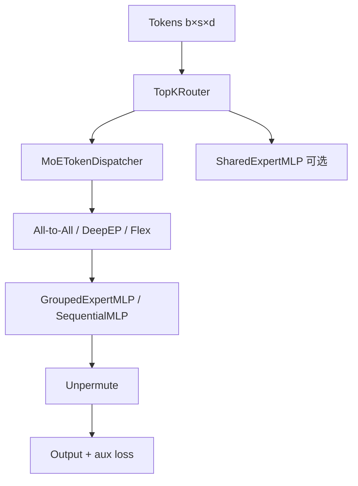

# 05 - Transformer、MoE 与高级架构

## TransformerConfig 总览

源码：`megatron/core/transformer/transformer_config.py`（约 2700+ 行）

`TransformerConfig` 继承 `ModelParallelConfig`，集中定义 **模型结构 + 并行 + 重计算 + 精度 + MoE** 等参数，是 Core 的「单一事实来源」。

### 架构字段（节选）

| 字段 | 说明 |
|------|------|
| `num_layers` | Transformer 层数 |
| `hidden_size` | 隐藏维 D |
| `num_attention_heads` | Q 头数 |
| `num_query_groups` | GQA：KV 头数（< num_heads） |
| `ffn_hidden_size` | MLP 中间维（SwiGLU 时常为 8/3 × hidden） |
| `swiglu` | 是否 SwiGLU FFN |
| `normalization` | LayerNorm / RMSNorm |
| `qk_layernorm` | Q/K LayerNorm（DeepSeek 等） |
| `multi_latent_attention` | 启用 MLA |
| `experimental_attention_variant` | DSA 等实验注意力 |
| `recompute_granularity` | full / selective 激活重算 |
| `recompute_modules` | mla、moe、mlp、norm 等细粒度 |

### MoE / MTP 字段

| 字段 | 说明 |
|------|------|
| `num_moe_experts` | Expert 总数 |
| `moe_router_topk` | 每 token 路由 Top-K |
| `moe_aux_loss_coeff` | Load balancing 辅助 loss 系数 |
| `moe_token_dispatcher_type` | allgather / alltoall / flex |
| `moe_shared_expert_intermediate_size` | Shared expert（Qwen 等） |
| `mtp_num_layers` | Multi-Token Prediction 层数 D |
| `mtp_loss_scaling_factor` | MTP 辅助 loss 权重（默认 0.1） |

## Transformer 层栈

```
TransformerBlock (transformer_block.py)
  └── TransformerLayer × N (transformer_layer.py)
        ├── Self-Attention (attention.py / dot_product_attention.py)
        ├── MLP 或 MoELayer (mlp.py / moe/moe_layer.py)
        └── LayerNorm / TE 融合层
```

### ModuleSpec 注入

层实现不硬编码，通过 `gpt_layer_specs.py` 选择：

- `get_gpt_layer_with_transformer_engine_spec` — TE 融合 kernel
- `get_gpt_layer_local_spec` — 纯 PyTorch
- `get_gpt_layer_with_inference_spec` — 推理优化

`training/models/gpt.py` 的 `default_layer_spec()` 根据 `transformer_impl` 选择。

## MoE 栈（生产级）

路径：`megatron/core/transformer/moe/`



### 核心文件

| 文件 | 职责 |
|------|------|
| `moe_layer.py` | MoE 层入口，组合 router + dispatcher + experts |
| `router.py` | TopK gating、auxiliary load balancing loss |
| `token_dispatcher.py` | 训练：AllGather / AllToAll / **Flex**（DeepEP） |
| `token_dispatcher_inference.py` | 推理 dispatch |
| `experts.py` | GroupedGEMM、SequentialMLP |
| `shared_experts.py` | 共享 expert 路径 |
| `fused_a2a.py` | 融合 all-to-all |
| `moe_utils.py` | CUDA Graph、token 统计 |

### Token Dispatcher 类型

| 类型 | 类 | 场景 |
|------|-----|------|
| AllGather | `MoEAllGatherTokenDispatcher` | 经典 EP |
| AllToAll | `MoEAlltoAllTokenDispatcher` | 标准 EP 通信 |
| Flex | `MoEFlexTokenDispatcher` | DeepEP、HybridEP（GB200/B200/H100） |

CLI 示例：`--moe-token-dispatcher-type flex --moe-enable-deepep`

### 支持的 MoE 模型（moe/README.md）

- DeepSeek-V2/V3（含 MTP）
- Qwen2-57B-A14B、Qwen3-30B/235B
- Mixtral-8x7B、8x22B

### 性能特性

- Dropless MoE（无 token drop）
- `--overlap-moe-expert-parallel-comm` EP 通信与计算重叠
- Router fusion kernel（`--moe-router-fusion`）
- FP8 GroupedGEMM
- FSDP + EP 组合
- CUDA Graph（`--cuda-graph-scope attn` 等）

## Multi-Latent Attention (MLA)

`multi_latent_attention.py` — DeepSeek-V2/V3 关键技术：

- KV 投影到低维 **latent**，降低 KV cache / 带宽
- 训练与推理 layout 不同；`experimental_attention_variant/absorbed_mla.py` 为吸收版
- 与 **Context Parallel (CP)** 联调

## Multi-Token Prediction (MTP)

`multi_token_prediction.py`：

- 每位置用 trunk hidden state 预测未来 D 个 token
- `process_mtp_loss()` 加权并入总 loss
- PP layout 需指定 MTP 层所在 stage（`get_mtp_ranks()`）

## 其他架构入口

| 脚本 | 架构 |
|------|------|
| `pretrain_mamba.py` | Mamba SSM |
| `pretrain_hybrid.py` | Transformer + Mamba（Falcon-H1 等） |
| `pretrain_vlm.py` | 视觉-语言 |
| `architectures/train_dit.py`（beyond-nanogpt 对照） | DiT 扩散 |

Core 含 `heterogeneous/` — 层类型混合（alternating attention/linear）。

## 与 beyond-nanogpt 对照

| 主题 | beyond-nanogpt | Megatron |
|------|----------------|----------|
| MoE scatter/gather | 单卡教学、零 for-loop | EP + A2A + GroupedGEMM 多卡 |
| MLA | notebook | 训练+推理+CP 全栈 |
| MTP | `train_mtp.py` 简化 | PP layout + loss scaling |
| Mamba | `train_mamba.py` 教学 | `pretrain_mamba` + hybrid specs |

## 关键 CLI（MoE 示例）

```bash
--num-experts 64
--moe-router-topk 6
--expert-model-parallel-size 8
--moe-token-dispatcher-type flex
--moe-aux-loss-coeff 0.01
--mtp-num-layers 1
--multi-latent-attention
```

具体 recipe 见 `examples/` 与 [Megatron Bridge](https://github.com/NVIDIA-NeMo/Megatron-Bridge) 模型目录。

## 源码入口

```36:72:megatron/core/transformer/moe/moe_layer.py
from megatron.core.transformer.moe.router import TopKRouter
from megatron.core.transformer.moe.token_dispatcher import (
    MoEAllGatherTokenDispatcher,
    MoEAlltoAllTokenDispatcher,
    MoEFlexTokenDispatcher,
    ...
)
```

MoE 路线图：https://github.com/NVIDIA/Megatron-LM/issues/1729
