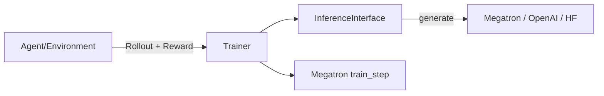

# 08 - 推理与 Megatron-RL

## 推理（Inference）

### Core 路径

`megatron/core/inference/`

- Text generation engines
- KV cache / static batching
- MoE inference grouped GEMM
- CUDA Graph 推理 scope

### 工具脚本

| 脚本 | 用途 |
|------|------|
| `tools/run_text_generation_server.py` | HTTP 文本生成服务 |
| `tools/run_hybrid_text_generation_server.py` | Hybrid 模型 |
| `tools/run_dynamic_text_generation_server.py` | 动态 batch |
| `tools/run_inference_performance_test.py` | 性能测试 |
| `tools/text_generation_cli.py` | CLI 交互 |

### 与 vLLM / llama.cpp 关系

- Megatron 训练权重需 **Bridge 转换** 或 checkpoint convert 后部署
- 本仓库 `03-推理部署/vllm`、`llama.cpp` 为生产推理栈
- Megatron inference server 适合 **训练同栈验证**

## Megatron-RL

路径：`megatron/rl/` · 入口：`train_rl.py`

### 状态（README）

> 2025-08：内部可用，**部分代码未完全对外开放**；外部用户能力受限。路线图见 GitHub #1776。

### 设计哲学

- **Agent**：持有 `InferenceInterface`，返回 `Rollout` / `EvaluationResponse`
- **Trainer**：编排 rollout、训练；与 Megatron `training.py` 集成
- **InferenceInterface**：`.generate(prompt, **kwargs)` 抽象

### 目录

| 路径 | 内容 |
|------|------|
| `rl/agent/` | reward agent、HF dataset agent、remote agent |
| `rl/inference/` | Megatron inference 封装 |
| `rl/server/` | FastAPI env server |
| `examples/rl/` | 示例 environment |

### 训练集成

- `training.py` 中 `perform_rl_step` 分支
- `--skip-train` + `--perform-rl-step`：仅 rollout
- 修改 Core inference 以支持 batch 生成

### 与 beyond-nanogpt / NeMo 对照

| | beyond-nanogpt GRPO | Megatron-RL | NeMo RL |
|---|---------------------|-------------|---------|
| 规模 | 单卡小模型 | 多卡 Megatron 模型 | 企业部署 |
| 算法 | 手写 GRPO | 可扩展 trainer | 开箱 RLHF/DPO |

## Post-Training

`megatron/post_training/` — NVIDIA ModelOpt：

- 量化、蒸馏、剪枝
- `post_training/loss_func.py` 与 `pretrain_gpt` 可选集成

## Elastification

`megatron/elastification/` — Flextron 弹性宽度/深度训练实验性支持。

## 推理 + RL 学习路径

1. `tools/run_text_generation_server.py` — 熟悉生成 API
2. `examples/rl/` — 最小 agent
3. `train_rl.py` + `megatron/rl/README.md`
4. 生产 RL：NeMo RL 或自研 scheduler + Megatron 训练
