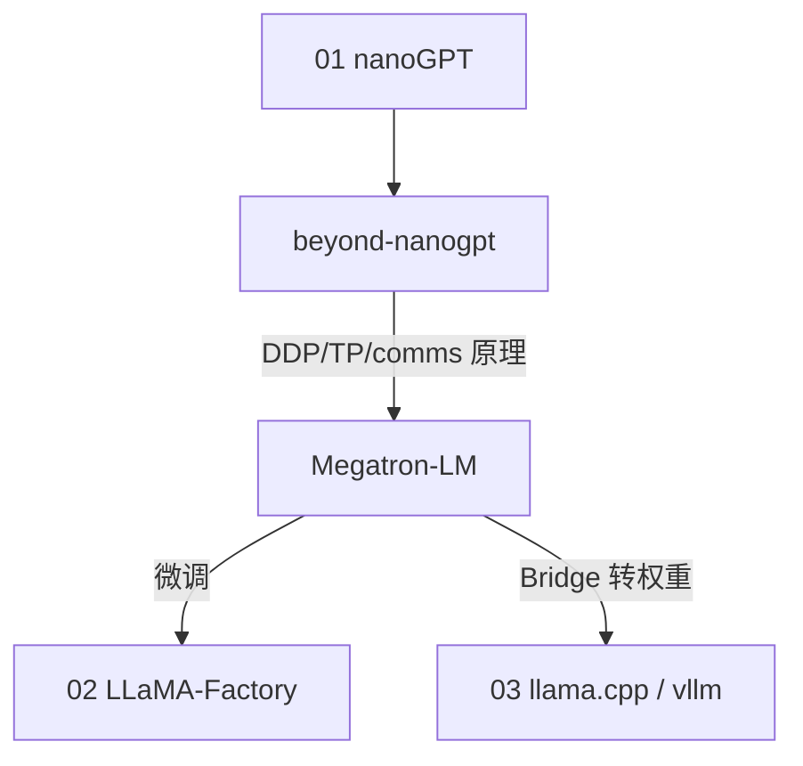

# 11 - 与本仓库模块的对照

## 学习路径衔接

| 阶段 | 模块 | 学到什么 |
|------|------|----------|
| 1 | nanoGPT | 最小 LM 训练循环 |
| 2 | beyond-nanogpt | 手写 DDP/TP、MoE 教学、GRPO |
| 3 | **Megatron-LM** | 工业级 3D 并行 + MoE + checkpoint |
| 4 | LLaMA-Factory | SFT/DPO 工程 |
| 5 | vLLM/llama.cpp | 推理部署 |

## beyond-nanogpt ↔ Megatron

| 主题 | beyond-nanogptDoc | Megatron-LMDoc |
|------|-------------------|----------------|
| Allreduce | `08-mlsys.md` comms.py | NCCL + `comms` 封装 |
| DDP | train_ddp.py | `core/distributed/` |
| TP | train_tp.py | `tensor_parallel/layers.py` |
| MoE | train_moe.py | `transformer/moe/` + EP |
| GRPO | train_grpo_gsm.py | Megatron-RL（部分） |

## Megatron Bridge

外部仓库：**HF ↔ Megatron** checkpoint 与 recipes。

- 本仓库训练 Megatron → Bridge 转 HF → vLLM/llama-server
- 或 HF 权重 → Bridge → Megatron 继续预训练

## LLaMA-Factory

- 定位：**微调**（LoRA、DPO），非 TB 级 pretrain
- Megatron 产出 base model → Factory 做 instruction tuning

## 推理栈

| 训练 | 推理 |
|------|------|
| Megatron-LM | Megatron Bridge → GGUF/HF |
| | llama.cpp（本仓库 03） |
| | vLLM |

## 业务 RAG（kefu-kb）

- 不需要 Megatron 训练即可运行
- 若自训 base model：Megatron pretrain → Bridge → 微调 → 量化 → llama-server

## 推荐阅读组合

1. `beyond-nanogptDoc/08-ML系统.md` + `Megatron-LMDoc/03-并行策略.md`
2. `beyond-nanogptDoc/05-架构变体.md` (MoE) + `05-Transformer与MoE高级架构.md`
3. `Megatron-LMDoc/09-pretrain_gpt.py精读.md` + 官方 Quickstart

## 规模预期

| 环境 | 适合 |
|------|------|
| 单卡 24GB | mock-data、极小模型 debug |
| 8×GPU 节点 | 小模型真实 pretrain 实验 |
| 多节点 + 高速网 | MoE/大模型（Megatron 设计目标） |

beyond-nanogpt 单卡友好；Megatron 需多卡才能体现价值。
