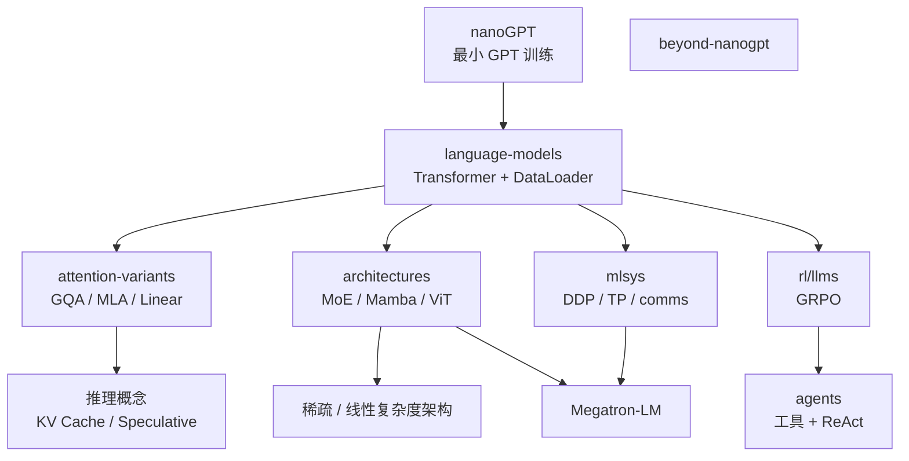
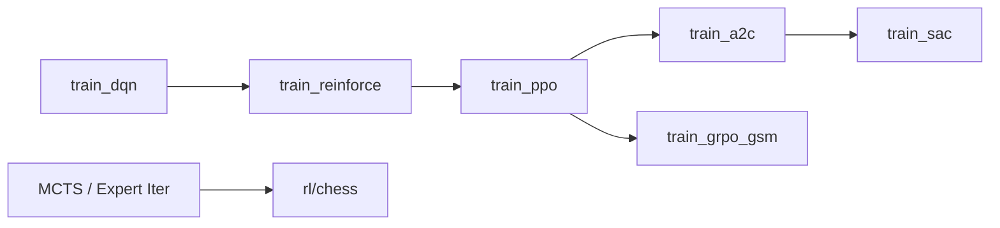

# 02 - 学习路径与模块关系

## 从 nanoGPT 到 Research



## 推荐学习顺序（本仓库语境）

### 阶段 1：LLM 核心巩固（1–2 周）

| 顺序 | 内容 | 文件 |
|------|------|------|
| 1 | Decoder-only Transformer | `language-models/transformer.py` |
| 2 | 朴素训练 | `language-models/train_naive.py` |
| 3 | 优化 DataLoader | `dataloaders/dataloader0→2.py` |
| 4 | 完整训练管线 | `language-models/train_full.py` |
| 5 | BPE 分词 | `language-models/bpe.ipynb` |
| 6 | RoPE | `language-models/rope.ipynb` |

**目标**：理解 pretrain 循环、多进程 dataloading、position encoding。

### 阶段 2：推理与 Attention（1 周）

| 顺序 | 内容 | 文件 |
|------|------|------|
| 1 | Vanilla / MHSA | `attention-variants/vanilla_attention.ipynb`, `mhsa.ipynb` |
| 2 | GQA | `attention-variants/gqa.ipynb` |
| 3 | KV Cache | `language-models/KV_cache.ipynb` |
| 4 | 投机解码 | `language-models/speculative_decoding.ipynb` |
| 5 | Linear / Sparse / MLA | 对应 notebooks |

**对照**：`03-推理部署/llama.cppDoc/` 中 KV、batch、decode graph。

### 阶段 3：架构扩展（2 周）

| 顺序 | 内容 | 文件 |
|------|------|------|
| 1 | MoE scatter/gather* | `architectures/train_moe.py` |
| 2 | Mamba SSM* | `architectures/train_mamba.py` |
| 3 | ViT / DiT | `train_vit.py`, `train_dit.py` |
| 4 | MTP | `language-models/train_mtp.py` |

### 阶段 4：生成式建模（1–2 周）

| 顺序 | 内容 | 文件 |
|------|------|------|
| 1 | Autoencoder → VAE | `train_autoencoder.py`, `train_vae.py` |
| 2 | GAN / Pix2Pix | `train_gan.py`, `train_pix2pix.py` |
| 3 | DDPM* | `train_ddpm.py` |
| 4 | Classifier guidance | `ddpm_classifier_*.py` |
| 5 | Flow Matching | `train_flow_matching.py` |

**要点**：目标函数设计比架构更重要（见 LESSONS.md）。

### 阶段 5：强化学习（2–3 周）



| 层级 | 目录 | 关键概念 |
|------|------|----------|
| 基础 | `rl/fundamentals/` | ε-greedy、policy gradient、GAE、clip |
| Actor-Critic | `rl/actor-critic/` | 并行 rollout、off-policy、entropy |
| Model-based | `rl/model-based/` | MPC、MCTS expert iteration |
| LLM RL | `rl/llms/` | GRPO、group advantage、KL to ref |
| 棋类 | `rl/chess/` | AlphaZero 管线（进行中） |

### 阶段 6：系统与规模（1–2 周）

| 顺序 | 内容 | 文件 |
|------|------|------|
| 1 | send/recv → allreduce | `mlsys/comms.py` |
| 2 | 手写 DDP | `mlsys/train_ddp.py` |
| 3 | Tensor Parallel | `mlsys/train_tp.py` |
| 4 | Triton 内核 | `mlsys/kernels/*.py` |

**下一步**：`Megatron-LM/pretrain_gpt.py` 工业级 3D 并行。

### 阶段 7：评估、RAG、Agent（1 周）

| 顺序 | 内容 | 文件 |
|------|------|------|
| 1 | GSM8K eval | `evals/eval_gsm8k.py` |
| 2 | MMLU / SimpleQA | `eval_mmlu.py`, `eval_simpleqa.py` |
| 3 | RAG 101 | `rag/intro_rag.py` |
| 4 | Coding Agent | `agents/coding-agent/agent.py` |

**对照**：`05-RAG/llama_indexDoc/`、`07-业务应用/kefu-kb/`。

## 模块依赖关系

```
evals/eval_gsm8k.py  ←── 被引用 ──  rl/llms/train_grpo_gsm.py
evals/eval_simpleqa.py ←── 扩展 ──  rag/intro_rag.py
language-models/transformer.py ←── 被 MTP/KV notebook 引用
mlsys/comms.py ←── 概念基础 ──  train_ddp.py, train_tp.py
dataloaders/v2 ←── 设计模式 ──  rl/actor-critic/train_impala.py (producer-consumer)
```

## 消费者-生产者模式（横切主题）

同一模式出现在：

1. **DataLoader v2**：CPU worker 预处理 → GPU 训练
2. **IMPALA**：CPU rollout → GPU 梯度更新
3. **Async RAG eval**：asyncio 并发 API 请求

详见 [12-engineering-lessons.md](./12-engineering-lessons.md)。

## 硬件建议

| 任务 | 建议 |
|------|------|
| 大多数 `.py` 训练 | 单 GPU（否则极慢） |
| DDP / TP | 多 GPU 节点 + `torchrun` |
| GRPO / evals | GPU + HuggingFace 模型下载 |
| Coding Agent | API Key（Together/Anthropic），可无 GPU |
| Notebooks | GPU 推荐，CPU 可小实验 |

## 自测方式

作者建议的学习法：

1. **精读** 源码与注释
2. **改** 超参、小 hack
3. **从零重写** 并与原版对比
4. **跑** `--wandb` 看曲线是否符合预期

 particularly tricky（*）项：MoE scatter/gather、Mamba 离散化、MLA、IMPALA、SAC、DDPM、TP、ring allreduce。
