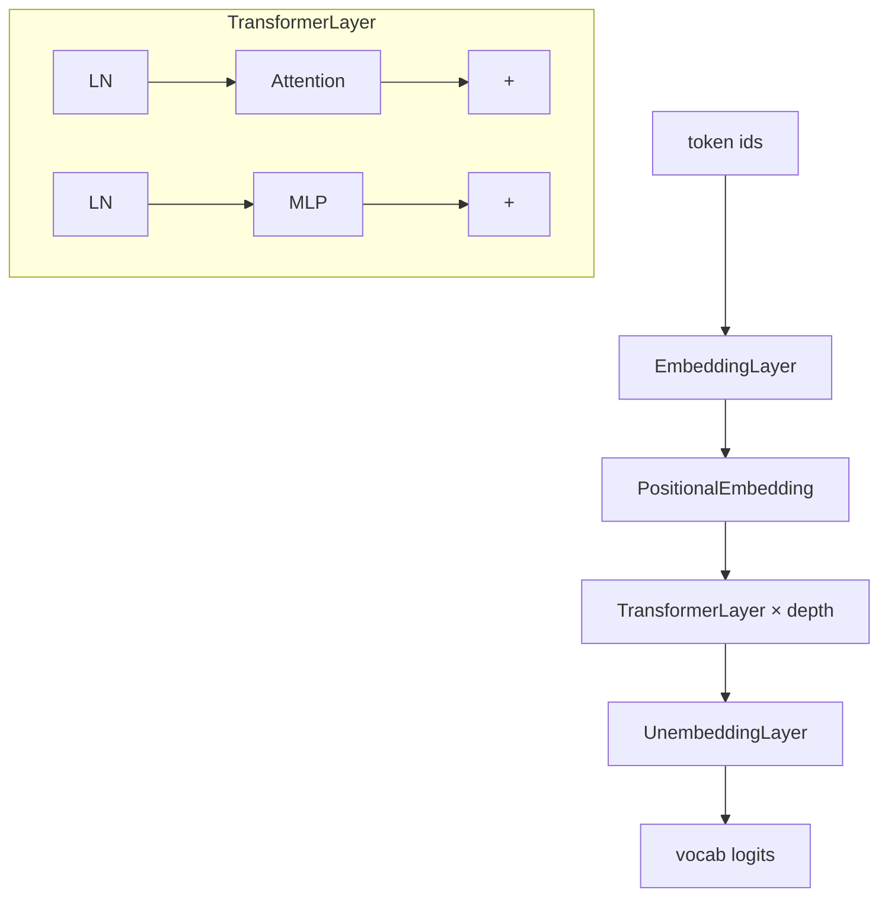

# 03 - Language Models

目录：`language-models/`

## 文件一览

| 文件 | 类型 | 说明 |
|------|------|------|
| `transformer.py` | 核心库 | Decoder-only Transformer 模块定义 |
| `train_naive.py` | 训练 | TinyStories + 简单加载 |
| `train_full.py` | 训练 | 使用 hand-written DataLoader v2 |
| `train_mtp.py` | 训练 | Multi-Token Prediction |
| `dataloaders/dataloader0.py` | 系统 | 单进程朴素加载 |
| `dataloaders/dataloader1.py` | 系统 | 多 worker + shared memory |
| `dataloaders/dataloader2.py` | 系统 | Ring buffer + pinned memory |
| `dataloaders/bench_dataloader.py` | 基准 | 三版吞吐对比 |
| `bpe.ipynb` | 教程 | Byte-Pair Encoding |
| `rope.ipynb` | 教程 | Rotary Position Embedding* |
| `KV_cache.ipynb` | 教程 | 推理 KV 缓存 |
| `speculative_decoding.ipynb` | 教程 | 投机解码 |

## Transformer 架构（transformer.py）

### 模块组成



### 关键类

| 类 | 形状 | 职责 |
|----|------|------|
| `Attention` | BSD→BSD | Multi-head causal self-attention，可选 `kv_cache` |
| `MLP` | 逐 token | up_proj → act → down_proj |
| `LN` | 手写 LayerNorm | mean/var 沿最后一维 |
| `Transformer` | - | `depth` 层，`mtp` 可选多 token 头 |

### Attention 与 KV Cache

```python
# transformer.py 核心逻辑
if kv_cache is not None and layer_idx is not None:
    kv_cache.update(layer_idx, K, V)
    K = kv_cache.keys[layer_idx][:, :, :kv_cache.current_length, :]
    V = kv_cache.values[layer_idx][:, :, :kv_cache.current_length, :]
```

- 每层 `layer_idx` 写入预分配 cache
- Decode 时只算新 token 的 Q，K/V 从 cache 读取历史
- 与 `KV_cache.ipynb` 配套学习

### MTP（Multi-Token Prediction）

`TransformerConfig.mtp=True` 时：

- forward 返回 trunk hidden states（非 logits）
- `mtp_heads[i]` 用位置 t 的表示预测 token t+i（i=0..3）

见 `train_mtp.py` 与论文 [DeepSeek-V3 MTP](https://arxiv.org/abs/2404.19737)。

## 训练脚本对比

| 脚本 | 数据 | DataLoader | 用途 |
|------|------|------------|------|
| `train_naive.py` | TinyStories (HF) | HF 默认 / 简单 | 快速验证 |
| `train_full.py` | TinyStories | dataloader2（默认） | 生产向 pretrain 模拟 |
| `train_mtp.py` | TinyStories | 同 full | MTP 辅助损失 |

`train_full.py` 支持 `--slowload` 切换 dataloader0。

## DataLoader 三版演进

### v0 — Naive（dataloader0.py）

- 单进程逐行读 JSONL + 同步 tokenize
- **~28%** 训练时间花在 loading（README  profiling）

### v1 — Assembly Line（dataloader1.py）

- 多进程读块 + tokenize
- Shared memory batch buffer
- Prefetch queue 解耦 I/O 与 GPU

### v2 — Ring Buffer Beast（dataloader2.py）

- 预分配 **pinned CPU** ring buffer
- Chunk 级文件切分（避免行边界问题）
- free/full slot 队列管理
- **orjson** 加速 JSON 解析

### 性能（bench_dataloader.py，500 batches）

| 版本 | Tokens/sec | Batches/sec |
|------|------------|-------------|
| v0 | 0.690M | 21.05 |
| v1 | 0.870M | 26.60 |
| v2 | **1.117M** | **34.15** |

**设计教训**（language-models/README.md）：

- v1 曾设计 reader_workers + batch_workers 两层，IPC 开销反而更大
- `.copy_` 优于反复 `torch.tensor(x)`
- 理解 CPU-GPU 流水线对 IMPALA 等同样适用

## Notebooks 要点

### bpe.ipynb

- BPE merge 规则、词表构建
- 连接 pretrain 数据预处理

### rope.ipynb

- 复数域旋转 / 分块 apply
- 与 `train_moe.py` 中 RoPE 用法一致（cos/sin 传入 layer）

### KV_cache.ipynb

- Prefill vs Decode 两阶段
- `current_length` 指针管理
- 与 llama.cpp KV cache 概念对齐

### speculative_decoding.ipynb

- Draft model + target model
- 接受/拒绝采样加速 decode
- 对照 `03-推理部署/llama.cpp` speculative 实现

## Config 模式

`transformer.py` 使用 `@dataclass` 配置：

```python
@dataclass
class TransformerConfig:
    vocab_size: int
    depth: int = 8
    hidden_dim: int = 512
    max_seq_len: int = 16384
    device: Optional[torch.device] = None
    mtp: bool = False
```

各子模块（Attention、MLP、LN）独立 Config，便于单测与 notebook 复用。

## 与 nanoGPT 对照

| 项目 | nanoGPT | beyond-nanogpt transformer.py |
|------|---------|-------------------------------|
| 结构 | 一个 GPT 类 | 拆分为 Attention/MLP/LN/Emb |
| LN | LayerNorm | 手写 LN |
| Pos | 可学习 absolute | absolute（RoPE 在 notebook/MoE） |
| KV | 有 | 有 + 独立 notebook |
| 数据 | 简单 memmap | 三版工业向 DataLoader |

## 运行示例

```bash
cd language-models

# 朴素训练
python train_naive.py --verbose

# 完整管线（dataloader v2）
python train_full.py --verbose --wandb

# DataLoader 基准
python dataloaders/bench_dataloader.py

# MTP
python train_mtp.py --verbose
```

## 源码入口

Transformer 前向（含 MTP 分支）：

```234:246:language-models/transformer.py
    def forward(self, x: torch.Tensor, kv_cache: Optional[Any] = None) -> torch.Tensor:
        x = self.emb(x)
        if kv_cache is not None:
            pos_offset = kv_cache.current_length
            pos_emb = self.pos_emb.pos_embedding[pos_offset: pos_offset + x.size(1)].unsqueeze(0)
            x = x + pos_emb
        else:
            x = self.pos_emb(x)
        for _, layer in enumerate(self.layers):
            x = layer(x, kv_cache=kv_cache)
        return x if self.mtp else self.unemb(x)
```
