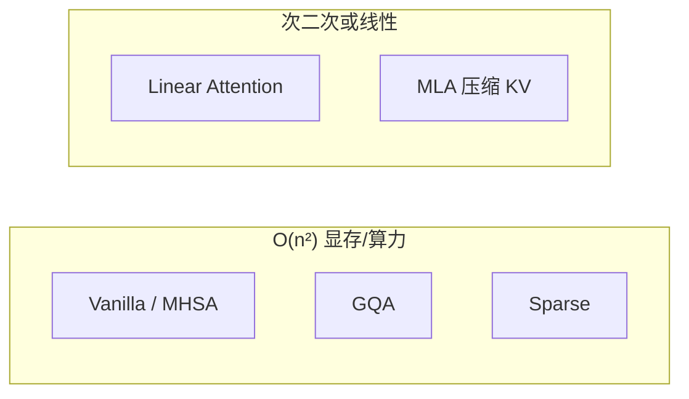

# 04 - Attention 变体

目录：`attention-variants/`（全部为 Jupyter Notebook）

## 总览

| Notebook | 论文/主题 | 核心思想 |
|----------|-----------|----------|
| `vanilla_attention.ipynb` | Transformer | \( \mathrm{softmax}(QK^T/\sqrt{d})V \) |
| `mhsa.ipynb` | Transformer | 多头并行 |
| `gqa.ipynb` | GQA [2305.13245](https://arxiv.org/abs/2305.13245) | 多 Q 头共享 K/V 头 |
| `linear_attention.ipynb` | Linear Attention* [2006.16236](https://arxiv.org/abs/2006.16236) | 核技巧避免 O(n²) |
| `sparse_attention.ipynb` | Sparse Transformers [1904.10509](https://arxiv.org/abs/1904.10509) | 结构化稀疏 mask |
| `cross_attention.ipynb` | Transformer | Q 来自一方，K/V 来自另一方 |
| `mla.ipynb` | DeepSeek MLA* [2405.04434](https://arxiv.org/abs/2405.04434) | 低秩 KV 压缩 |

## 复杂度对比



| 变体 | 注意力矩阵 | KV 缓存 | 典型用途 |
|------|------------|---------|----------|
| Vanilla | 完整 S×S | 完整 K,V | 教学 baseline |
| MHSA | 每头 S×S | 每头 K,V | 标准 Transformer |
| GQA | 每头 S×S，KV 头少 | **更少 KV** | Llama 3、推理部署 |
| Linear | 隐式，无 materialize | 不同形式 | 长序列研究 |
| Sparse | 稀疏 S×S | 取决于 pattern | 长上下文 |
| Cross | Q 长 ≠ KV 长 | Encoder-Decoder | 多模态、T5 |
| MLA | 低秩 latent | **极大压缩** | DeepSeek-V2/V3 |

## GQA（Grouped-Query Attention）

**动机**：推理瓶颈常在 **KV cache 带宽**，而非 QK  matmul。

- `n_heads` 个 Q 头
- `n_kv_heads` 个 K/V 头（`n_kv_heads < n_heads`）
- 每组 `n_heads // n_kv_heads` 个 Q 头共享同一 K/V

与 `language-models/transformer.py` 中「每头独立 K/V」对比，GQA 减少 cache 体积约 `n_kv_heads/n_heads`。

**学习建议**：读完 notebook 后对照 `03-推理部署/llama.cppDoc/` 中 GQA/MQA 实现。

## Linear Attention*

**核心**：用特征映射 \(\phi\) 使

\[
\mathrm{Attention}(Q,K,V) = \phi(Q)\big(\phi(K)^T V\big)
\]

先算 \(\phi(K)^T V\)（O(n)），再乘 \(\phi(Q)\)，避免显式 S×S 矩阵。

Notebook 含 **速度对比图**（README 中左侧 plot 来源）。

**注意**：线性注意力表达力与 softmax 注意力不同；Mamba 等 SS M 走另一条「线性复杂度」路线（见 [05-architectures.md](./05-architectures.md)）。

## Multi-Latent Attention (MLA)*

DeepSeek-V2/V3 关键技术：

- K/V 投影到低维 **latent**，再解压或直接与 Q 作用
- 极大降低 KV cache（Notebook 逐步推导维度）

标记为 *tricky*：涉及低秩分解、推理/训练等价变换。

## Cross Attention

- Query：decoder 状态
- Key/Value：encoder 输出
- 因果 mask 仅施加在 self-attention；cross 无因果限制

连接：`architectures/train_dit.py`（DiT 中 adaLN + self-attention，无 cross 但条件注入类似思想）。

## Sparse Attention

- 固定或学习稀疏 pattern（局部窗口 + 跨步连接等）
- 只 materialize 非零块，降低长序列成本

## 与 core Transformer 的关系

`language-models/transformer.py` 实现 **标准 causal MHSA**（手写 einsum + mask）。

Notebooks 是 **隔离实验环境**；高级变体在：

- `architectures/train_moe.py` — RoPE + `nn.MultiheadAttention`
- 生产代码 — llama.cpp / vLLM 中的 GQA/MLA

## 学习路径

1. `vanilla_attention` → `mhsa`（确保 softmax 维度正确）
2. `gqa`（推理优化必学）
3. `KV_cache.ipynb`（language-models/）+ `gqa` 一起看
4. `mla` 或 `linear_attention`（择一深入）
5. `sparse_attention`、`cross_attention` 按兴趣

## Notebook 使用

```bash
cd attention-variants
jupyter notebook gqa.ipynb
```

建议：**逐 cell 运行**，修改 head 数 / seq len 观察显存与耗时。

## 性能实验（README 引用）

Linear attention notebook 产生 LLM speedup 对比图；可与 speculative decoding、KV cache 组合理解现代推理栈：

```
Prefill:  compute-bound (大 matmul)
Decode:   memory-bound (KV cache 读取) → GQA/MLA 价值最大
```
