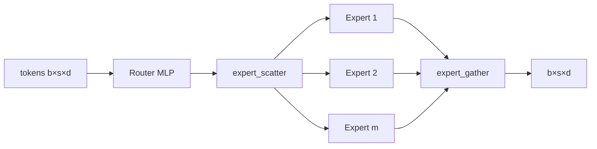
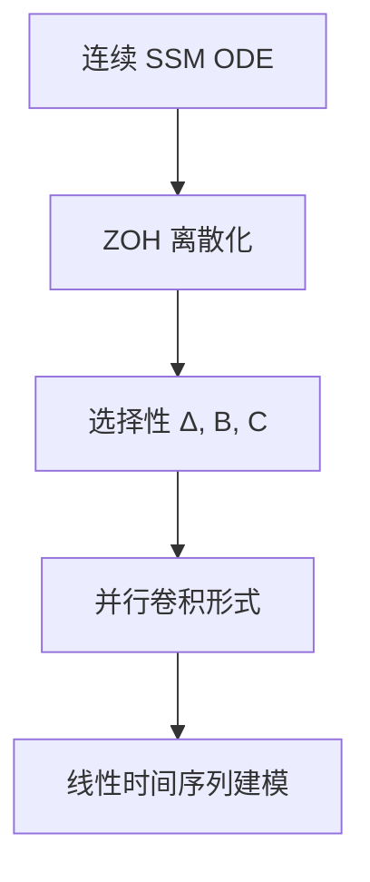

# 05 - 架构变体（Architectures）

目录：`architectures/` — 8 个独立训练脚本，各实现一种经典架构 + 完整训练循环。

## 文件一览

| 文件 | 架构 | 数据集/任务 | 难度 |
|------|------|-------------|------|
| `train_vit.py` | Vision Transformer | 图像分类 | 中 |
| `train_dit.py` | Diffusion Transformer | 图像生成（扩散） | 中高 |
| `train_resnet.py` | ResNet | 图像分类 | 低 |
| `train_rnn.py` | RNN | 序列 | 低 |
| `train_lstm.py` | LSTM | 序列 | 中 |
| `train_mlp_mixer.py` | MLP-Mixer | 图像 | 中 |
| `train_moe.py` | MoE Transformer* | 语言建模 | **高** |
| `train_mamba.py` | Mamba SSM* | 序列建模 | **高** |

## 共同模式

每个 `train_*.py` 通常包含：

1. 文件头：论文链接 + 实现要点
2. 模型类（尽量手写，少依赖高层 API）
3. 数据加载（HF datasets / torchvision）
4. 训练循环 + `argparse`（`--verbose`, `--wandb`）
5. 可选 eval / 可视化

## MoE（train_moe.py）*

论文：Switch Transformers、GShard

### 结构

标准 Transformer，**MLP 替换为 MoEMLP**：



### 关键超参

| 参数 | 含义 |
|------|------|
| `m` | expert 数量 |
| `top_k` | 每 token 路由到几个 expert |
| `c` | overflow capacity（相对公平份额的倍数） |
| overflow | 超出容量的 token **原样 passthrough** |

### 实现亮点

- **零 for-loop**：scatter/gather 全向量化（作者认为最有教学价值的 PyTorch 练习之一）
- RoPE 嵌入（cos/sin 传入 attention）
- Router logits 可用于 load balancing 辅助损失（Switch 论文）

### 核心难点

理解 `expert_scatter` / `expert_gather` 的 **维度变换**：

- Router: `[b,s,d] → [b,s,m]`
- Scatter: 按 expert 索引把 token 批到 `[m, capacity, d]`
- Gather: 按 top_k 权重合并回 `[b,s,d]`

## Mamba（train_mamba.py）*

论文：[Mamba: Linear-Time Sequence Modeling with Selective State Spaces](https://arxiv.org/abs/2312.00752)

### 概念链



### 与 Transformer 对比

| | Transformer | Mamba |
|---|-------------|-------|
| 复杂度 | O(n²) attention | O(n) recurrence/conv |
| 记忆 | 显式 KV | 压缩状态 s(t) |
| 选择性 | 数据依赖 QK | **数据依赖 Δ, B, C**（time-variant params） |
| 并行训练 | 天然 | 卷积展开 |

### 文件内长注释涵盖

- 线性 vs 非线性、时不变 vs 时变（RNN/LSTM/S4/Mamba 对照表）
- ZOH 离散化推导 → \(A_d = \exp(\Delta A)\), \(B_d\) 公式
- 对角 A 假设与稳定性（特征值实部 < 0）
- 为何学连续参数再离散化（约束 contraction）

**前置知识**：基本 ODE、卷积与 recurrence 等价、linear attention notebook 有助于类比。

## Vision Transformer（train_vit.py）

- 图像 patch → token 序列
- [CLS] token 或 global average pool 分类
- 标准 Transformer encoder（非 causal）

## DiT（train_dit.py）

- Diffusion Transformer：patchify + transformer blocks
- **adaLN** 注入 timestep 条件
- 与 `generative-models/train_ddpm.py`（U-Net 骨干）对照

## 经典基线

| 文件 | 教学价值 |
|------|----------|
| `train_resnet.py` | 残差连接、BatchNorm |
| `train_rnn.py` / `train_lstm.py` | 序列建模前 Transformer 时代 |
| `train_mlp_mixer.py` | Token-mixing + Channel-mixing MLP，无 attention |

## 运行示例

```bash
cd architectures

python train_vit.py --verbose --wandb
python train_moe.py --verbose    # 建议先读 scatter/gather 注释
python train_mamba.py --verbose  # 建议先读文件头 SSM 推导
python train_dit.py --verbose
```

## 与 Megatron-LM 的关系

| beyond-nanogpt | Megatron-LM |
|--------------|-------------|
| 单文件 MoE 路由逻辑 | Expert parallel + 分布式路由 |
| 教学级 scatter/gather | NCCL + 张量并行 MoE |
| Mamba 单卡 | 大规模仍多用 Transformer |

学完 `train_moe.py` 再读 Megatron MoE 层会更容易理解 **token 到 expert 的路由与通信**。

## 源码片段：MoE 层 forward

```74:99:architectures/train_moe.py
    def forward(self, x, cos=None, sin=None): 
        ...
        x = residual + attn_out
        residual = x
        x = self.ln2(x)
        x, router_logits = self.mlp(x)  # MoEMLP
        x = residual + x
```

Attention 用 `nn.MultiheadAttention` + 手写 causal mask；MLP 为自研 MoE。
