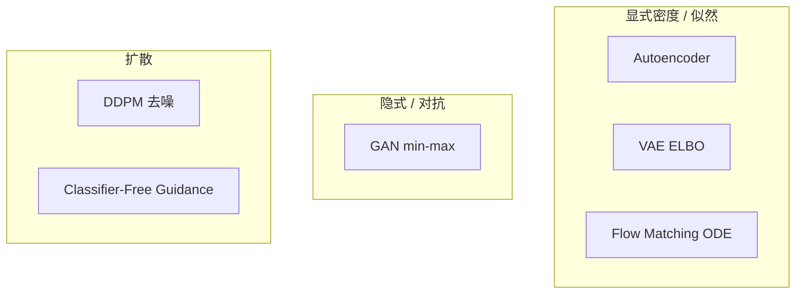

# 06 - 生成式模型（Generative Models）

目录：`generative-models/`

## 文件一览

| 文件 | 方法 | 骨干 | 数据 |
|------|------|------|------|
| `train_autoencoder.py` | Autoencoder | MLP/CNN | MNIST |
| `train_vae.py` | VAE | 同上 + reparam | MNIST |
| `train_gan.py` | GAN | Generator/Discriminator | MNIST |
| `train_pix2pix.py` | 条件 GAN | U-Net G + Patch D | 配对图像 |
| `train_ddpm.py` | DDPM* | 自研 U-Net | MNIST |
| `ddpm_classifier_guidance.py` | Classifier guidance | DDPM + 分类器 | 条件生成 |
| `ddpm_classifier_free_guidance.py` | CFG | 无条件/条件混合 | 条件生成 |
| `train_flow_matching.py` | Flow Matching | 向量场网络 | MNIST |

## 范式对比



| 范式 | 目标函数 | 采样 |
|------|----------|------|
| AE | 重建 MSE | 编码→解码 |
| VAE | ELBO（重建 + KL） | z ~ N(μ,σ) |
| GAN | D 分类 + G 欺骗 | z → G(z) |
| DDPM | ε 预测 MSE | 迭代去噪 |
| Flow Matching | 向量场匹配 | ODE 积分 |
| CFG | 条件/无条件 score 插值 | guided 去噪 |

**LESSONS.md 强调**：生成建模里 **目标函数设计** 往往比架构更根本（score = -∇log p，去噪 ≡ score matching）。

## DDPM（train_ddpm.py）*

### 历史脉络（文件头注释）

0. Hyvärinen / Vincent — score matching 与 denoising 等价  
1. DPM — 直接学 score  
2. **DDPM** — 学预测噪声 ε（本实现）  
3. Improved DDPM — schedule 与 VLB 改进  

### 训练目标

\[
\mathcal{L} = \mathbb{E}_{t,\epsilon}\|\epsilon - \epsilon_\theta(x_t, t)\|^2
\]

- 前向：\(x_t = \sqrt{\bar\alpha_t} x_0 + \sqrt{1-\bar\alpha_t}\epsilon\)
- 网络：U-Net，输入 `[b,ch,h,w]` + time embedding

### 架构组件

1. **GroupNorm**（非 LayerNorm）
2. **Sinusoidal time embedding** 注入各层
3. **U-Net** skip connections
4. 自研 `Conv` 支持 up/down sample

与 `architectures/train_dit.py` 对比：DiT 用 Transformer 处理 patch，DDPM 用卷积 U-Net。

## Classifier Guidance vs CFG

| 文件 | 机制 | 推理公式思想 |
|------|------|--------------|
| `ddpm_classifier_guidance.py` | 额外训练分类器 | score + ∇log p(y\|x) |
| `ddpm_classifier_free_guidance.py` | 单模型条件/无条件 | 插值 ε_cond 与 ε_uncond |

CFG 为 Stable Diffusion 等工业标准，无需单独分类器。

## VAE 与重参数化

文件注释与 LESSONS.md：**reparam trick 就是** `z = mean + std * ε`，对 mean/std 反传。

## GAN / Pix2Pix

- GAN：非饱和 loss、D/G 交替，loss 可不单调下降（与 DDPG 类似双网络耦合）
- Pix2Pix：L1 + 对抗，条件输入（边缘→照片等）

## Flow Matching（train_flow_matching.py）

- 学习 ODE 向量场，从噪声到数据
- 与 DDPM score-based 视角统一（probability flow ODE）
- 近年 DiT + flow 路线的基础

## 运行示例

```bash
cd generative-models

python train_ddpm.py --verbose --wandb
python train_vae.py --verbose
python ddpm_classifier_free_guidance.py --verbose
python train_flow_matching.py --verbose
```

README 中 **MNIST 采样图** 来自 `train_ddpm.py`。

## 学习顺序

1. `train_autoencoder.py` — 重建 baseline  
2. `train_vae.py` — 概率视角 + KL  
3. `train_gan.py` — 对抗训练动态  
4. `train_ddpm.py` — 扩散主路径  
5. `ddpm_classifier_free_guidance.py` — 条件生成  
6. `train_flow_matching.py` — 与扩散的统一视角  
7. `architectures/train_dit.py` — Transformer 扩散骨干  

## 与 LLM 的桥梁

| 生成式概念 | LLM 对应 |
|------------|----------|
| 去噪 / score | 尚未主流用于 text pretrain |
| Flow matching | 部分 image/video 模型 |
| CFG | 类似 instruction tuning 条件控制 |
| ELBO | VAE 式 latent（较少用于 LLM） |

扩散主要服务 **多模态 / 图像**；LLM 仍以 next-token 为主，但 DiT、Sora 类模型连接两者。
