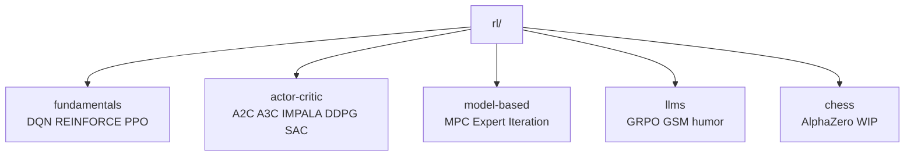

# 07 - 强化学习（Reinforcement Learning）

目录：`rl/` — 经典 RL、Model-based、LLM GRPO、Chess/AlphaZero。

## 子目录结构



## fundamentals/

| 文件 | 算法 | 环境 | 要点 |
|------|------|------|------|
| `train_dqn.py` | DQN | CartPole 等 | ε-greedy、experience replay、target net |
| `train_reinforce.py` | REINFORCE | CartPole | Monte Carlo policy gradient |
| `train_ppo.py` | PPO | CartPole | GAE、clip、value net、entropy bonus |

### PPO 核心（train_ppo.py）

**与 REINFORCE 差异**（文件头）：

1. **Advantage**：\(A = R - V(s)\)，单独 **ValueNet** + GAE(λ)
2. **多 epoch 复用 batch** + **ratio clip** 保持近 on-policy
3. **Entropy 正则** 鼓励探索

```python
# loss_fn 收集字段
(curr_state, action, logprob, reward, done, V(s), V(s'))
```

**现象**（LESSONS.md）：CartPole 上 reward 上升时 loss 也可能上升（episode 变长）。

运行：

```bash
cd rl/fundamentals
python train_ppo.py --verbose --wandb
```

README 右侧 **reward 曲线图** 来源此脚本。

## actor-critic/

| 文件 | 算法 | 特点 |
|------|------|------|
| `train_a2c.py` | A2C | 同步 actor-critic |
| `train_a3c.py` | A3C | 异步多 worker |
| `train_impala.py` | IMPALA* | CPU rollout + GPU 学习，V-trace |
| `train_ddpg.py` | DDPG | 连续动作，target actor/critic |
| `train_sac.py` | SAC* | 最大熵 RL，双 Q |

### IMPALA 与 DataLoader 同构

- **Producer**：CPU worker 做 rollout（小 batch forward）
- **Consumer**：GPU 从 shared memory buffer 大批量训练
- 与 `language-models/dataloaders/v2` **同一系统设计模式**

## model-based/

| 文件 | 方法 | 说明 |
|------|------|------|
| `train_mpc.py` | MPC | 用动力学模型滚动优化动作 |
| `train_expert_iteration.py` | Expert Iteration | MCTS 生成标签 → 监督学习 |

连接 `rl/chess/MCTS.py` 的搜索逻辑。

## llms/ — GRPO

| 文件 | 任务 | 模型 |
|------|------|------|
| `train_grpo_gsm.py` | GSM8K 数学推理 | HF CausalLM |
| `train_grpo_humor.py` | 幽默奖励 | 自定义 reward |

### GRPO 要点（train_grpo_gsm.py 文件头）

论文：DeepSeekMath GRPO、DeepSeek-R1

**核心思想**：

- 组内多条 rollout，用 **组内 reward 统计** 估计 advantage
- **无需单独 value head**（对比 PPO on LLM）
- 实现细节敏感：HF GRPOTrainer 与论文公式有 ablation 差异（clip、DrGRPO、|o_i| 项等）

**哲学**：换任务主要改 `reward_fn`，算法骨架不变 — **reward shaping = 目标设计**。

### 与 evals 关系

`train_grpo_gsm.py` **复用** `evals/eval_gsm8k.py` 的 prompt 模板与答案解析。

```bash
cd rl/llms
python train_grpo_gsm.py --verbose --wandb
```

## chess/ — AlphaZero（进行中）

| 文件 | 职责 |
|------|------|
| `model.py` | ResNet policy + value 双头 |
| `env.py` | `chess.Board` RL 包装 |
| `utils.py` | `board2input`、合法 move mask |
| `MCTS.py` | 蒙特卡洛树搜索 |
| `buffer.py` | 自对弈经验 |
| `train.py` | 训练骨架（未完成） |
| `test_all.py` | pytest |

**状态**（chess/README.md）：MCTS/env/model 已有，完整训练环、Elo 评估、性能优化 TODO。

依赖：`pip install python-chess pytest`

## RL 概念对照（LESSONS.md 摘要）

| 主题 | 要点 |
|------|------|
| On vs Off-policy | LLM pretrain 似 off-policy 但「能用」；长 horizon agent 需重视 |
| 探索 | ε-greedy vs 动作噪声 vs entropy |
| Loss vs Reward | 二者可脱钩；GAN/DDPG 双网耦合亦如此 |
| 目标函数 | RL 里 reward shaping 与 LLM 里 instruction 设计 analogous |

## 算法选择指南

| 场景 | 推荐起点 |
|------|----------|
| 离散小环境 | DQN → PPO |
| 连续控制 | DDPG → SAC |
| 分布式采样 | IMPALA |
| 棋类/搜索 | MCTS + Expert Iteration → chess/ |
| LLM 对齐 | GRPO（本仓库）→ RLHF/DPO（路线图 TODO） |

## 与 LLaMA-Factory / Megatron 关系

- beyond-nanogpt：**算法原理 + 小 scale 可跑通**
- LLaMA-Factory：DPO/PPO/GRPO **工程集成**
- Megatron：RLHF 大规模分布式（若部署）

本仓库 `train_grpo_gsm.py` 适合理解 **loss 如何逐 token 回传** 与 **group sampling**。

## 运行速查

```bash
# 经典 PPO
python rl/fundamentals/train_ppo.py --verbose --wandb

# 分布式 RL
python rl/actor-critic/train_impala.py --verbose

# LLM GRPO
python rl/llms/train_grpo_gsm.py --verbose --wandb

# Chess 测试
pytest rl/chess/test_all.py -v
```
