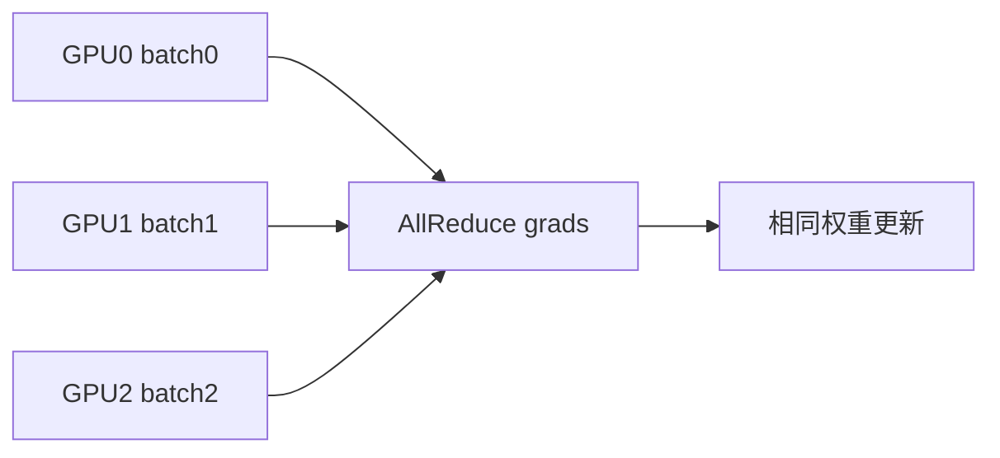

# 08 - ML 系统（MLSys）

目录：`mlsys/` — GPU 集合通信、分布式训练、Triton 内核。

## 文件一览

| 文件 | 主题 | 难度 |
|------|------|------|
| `comms.py` | scatter/gather/broadcast/allreduce | **高*** |
| `train_ddp.py` | 手写 Distributed Data Parallel | 中高 |
| `train_tp.py` | Tensor Parallel | **高*** |
| `kernels/*.py` | Triton GPU 内核 | 中 |

## comms.py — GPU 通信原语

### 动机

大规模 LLM 训练瓶颈常在 **多卡通信**。本文件用 `dist.send`/`dist.recv` **从零实现** 集合操作，理解 NCCL 语义。

### 实现的 collective

| 函数 | 语义 |
|------|------|
| `scatter` | root 切分 tensor 分到各 rank |
| `gather` | 各 rank 片段收集到 root |
| `broadcast` | root → 所有 rank |
| `reduce` | 聚合到 root |
| `allreduce` | 聚合后广播回所有 rank |
| `ring_allreduce` | 环拓扑 SUM，带宽最优类 |
| `tree_allreduce` | 树拓扑 |

### 工程要点（文件头注释）

1. **Process group**：每进程 init/destroy；hang 常因某 rank 提前 destroy  
2. **Collective 内禁止分配**：预分配 buffer，in-place 修改  
3. **Deadlock**：ring 中 even/odd rank 发送顺序（parity trick）  
4. **barrier**：collective 自带同步；`async_op=True` 需手动 wait  

### 运行

```bash
torchrun --nproc_per_node=4 mlsys/comms.py
```

## train_ddp.py — 数据并行

论文：PyTorch Distributed Experiences

### 概念



- 每卡 **完整模型副本**
- 每卡 **不同数据 shard**（`DistributedSampler`）
- 梯度 **平均** ≈ 全局 batch = local_batch × world_size

### 手写 DDP 关键机制

| 机制 | 作用 |
|------|------|
| `DistributedSampler` | 每 rank 不相交索引 |
| **Buckets** | 参数分组，避免逐参数 allreduce |
| **post_accumulate_grad_hook** | grad 就绪即触发 bucket allreduce |
| `async_op=True` | 通信与 backward 重叠 |

**仅假设** `dist.broadcast`、`dist.all_reduce` 可用 — 可与 `comms.py` 对照。

```bash
torchrun --nproc_per_node=2 mlsys/train_ddp.py
```

## train_tp.py — 张量并行*

论文：Megatron-LM TP

### 概念

单 layer 的权重 **切分到多卡**：

- Column parallel：\(Y = XA\)，A 按列分  
- Row parallel：输出 allreduce  

与 DDP（数据维复制）正交 → 生产用 **3D 并行**（DP+TP+PP）。

```bash
torchrun --nproc_per_node=2 mlsys/train_tp.py
```

**下一步**：`06-Research/Megatron-LM/megatron/core/tensor_parallel/`。

## kernels/ — Triton

| 文件 | 算子 |
|------|------|
| `vector_add.py` | 向量加 |
| `reverse_array.py` | 数组反转 |
| `copy2d.py` | 2D stride copy |
| `conv1d.py` | 1D 卷积 naive + tiled |
| `layernorm.py` | LayerNorm forward |
| `swiglu.py` | SwiGLU 激活 |
| `tiled_gemm.py` | 分块 GEMM |

### 与 ggml / llama.cpp 关系

| 层级 | 项目 |
|------|------|
| 教学 Triton | beyond-nanogpt/kernels |
| 生产 CPU/GPU kernel | `04-量化内核/ggml` |
| 推理集成 | `03-推理部署/llama.cpp` |

README 路线图 TODO：**FlashAttention Forward** Triton 尚未实现。

### 运行

各 kernel 文件通常含 self-test / benchmark，需安装 `triton`：

```bash
python mlsys/kernels/tiled_gemm.py
```

## 路线图 TODO（MLSys）

- [ ] Ring Attention（Context Parallel）
- [ ] Paged Attention
- [ ] Continuous Batching
- [ ] FlashAttention Forward

这些在 vLLM / llama.cpp 文档中有工业实现，本仓库留作扩展练习。

## 学习顺序

1. `comms.py` — 理解 allreduce 语义与 deadlock  
2. `train_ddp.py` — 单节点多卡最常用  
3. `kernels/tiled_gemm.py` + `layernorm.py` — GPU 编程直觉  
4. `train_tp.py` — 为 Megatron 读码做准备  

## LESSONS 关联

- GPU **独立显存** → 通信昂贵；CPU shared memory → `torch.share_memory_` + 队列传 index（DataLoader、IMPALA）
- 预分配 tensor、少 `torch.tensor(x)` 拷贝
- 用 `cumsum`、`bmm` 等原生算子替代 Python loop（kernel 与模型代码均适用）

## 与本仓库 llama.cppDoc 对照

| 主题 | beyond-nanogpt | llama.cppDoc |
|------|----------------|--------------|
| 多卡训练 | DDP/TP | 推理为主 |
| KV 内存 | TODO Paged Attention | 16-kv-cache-memory |
| Batch | TODO Continuous | 17-batch-system |
| 底层 GEMM | tiled_gemm.py | ggml CUDA backend |

推理侧优化建议学完本模块后读 `03-推理部署/llama.cppDoc/`。
