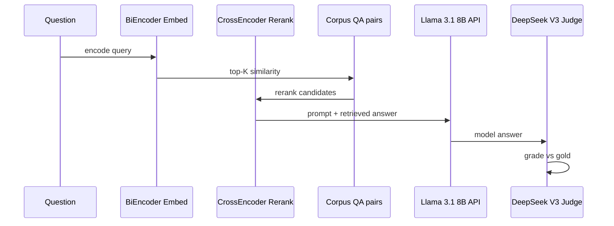

# 09 - 评估与 RAG（Evals & RAG）

## Evals 目录

| 文件 | 基准 | 类型 |
|------|------|------|
| `eval_gsm8k.py` | GSM8K | 生成式数学 |
| `eval_mmlu.py` | MMLU | 多选题 |
| `eval_simpleqa.py` | SimpleQA | LLM-as-judge 事实 QA |
| `prompts/simpleqa_templates.py` | - | 评判 prompt 模板 |

### GSM8K（eval_gsm8k.py）

- **任务**：小学数学 word problems  
- **格式**：CoT + `#### answer` 结尾  
- **实现**：HF `AutoModelForCausalLM` + ICL prompt  
- **解析**：regex 提取 `####` 后数字  

```bash
cd evals
python eval_gsm8k.py --model meta-llama/Llama-3.2-3B
```

**被引用**：`rl/llms/train_grpo_gsm.py` 共用 prompt 与判题逻辑。

### MMLU（eval_mmlu.py）

- 57 学科多选题  
- 通常 **logits 选 ABCD** 或生成字母  
- 测试 breadth 知识  

### SimpleQA（eval_simpleqa.py）

- 短事实问答，**LLM judge** 判 CORRECT/INCORRECT/NOT_ATTEMPTED  
- 难在问题 obscure，检索与模型知识均挑战大  

**被扩展**：`rag/intro_rag.py` 基于同一 eval 框架。

## RAG 目录

| 文件 | 说明 |
|------|------|
| `intro_rag.py` | 最小 RAG：embedding + rerank + context 注入 |
| `prompts/simpleqa_templates.py` | 与 evals 共享模板 |

### intro_rag.py 流程



### 模型与 API

| 组件 | 选型 |
|------|------|
| Embedding | `SentenceTransformer('all-MiniLM-L6-v2')` |
| Rerank | `CrossEncoder('cross-encoder/ms-marco-MiniLM-L-6-v2')` |
| Student | Llama 3.1 8B（Together API） |
| Teacher/Judge | DeepSeek V3 |

### 实验结果（文件头注释）

| 设置 | P(right) | P(right\|attempted) |
|------|----------|---------------------|
| 无 RAG | 0.056 | 0.065 |
| 有 RAG | **0.288** | **0.320** |

**未达 100% 原因**：

- 检索瓶颈：答案过短（如 "Paris"）时 biencoder 难匹配  
- SimpleQA 问题 obscure，语义检索需「近似已知答案」  

### 工程优化

- **asyncio** 并发 API：100 题 ~4min → ~4s（IO bound）  
- 与 `07-业务应用/kefu-kb` 对比：kefu 用 Qdrant + llama-server 本地；intro_rag 用内存 corpus + API  

### 运行

```bash
cd rag
python intro_rag.py
# 需配置 Together 等 API key
```

## 与 llama_index / kefu-kb 对照

| 维度 | intro_rag.py | llama_index | kefu-kb |
|------|--------------|-------------|---------|
| 框架 | 单文件脚本 | VectorStoreIndex 等 | FastAPI MVP |
| 向量库 | 内存 + sklearn 相似度 | Qdrant/Chroma… | Qdrant |
| 嵌入 | SentenceTransformer | OpenAILike/HF | llama-server |
| 目标 | 教学 eval 对比 | 生产编排 | 业务客服 |

学习路径：intro_rag → `05-RAG/llama_indexDoc/` → kefu-kb 落地。

## agents/basic-search-use/

| 文件 | 说明 |
|------|------|
| `chat_search.py` | LLM + 互联网搜索做 QA |
| `prompts.py` | 搜索增强 prompt |

比 intro_rag **多一步**：模型主动搜索，而非给定 corpus 检索。

详见 [10-Agent系统.md](./10-Agent系统.md)。

## Eval 设计原则（路线图）

README TODO：**Design our own eval ("good taste")** — 强调领域相关、可解释 rubric，而非仅刷公开榜。

## 运行速查

```bash
# 数学
python evals/eval_gsm8k.py

# 多选
python evals/eval_mmlu.py

# 事实 + judge
python evals/eval_simpleqa.py

# RAG ablation
python rag/intro_rag.py
```

## Prompt 模板结构（GSM8K）

```python
PROMPT_TEMPLATE = """
You are a helpful language model assistant correctly solving math problems...
Examples: {icl_examples}
Question: {question}
Answer: 
"""
```

ICL 示例数、temperature、max_new_tokens 均影响与 GRPO 训练一致性 — 训练/评测应 **共用模板**（GRPO 已遵循）。
