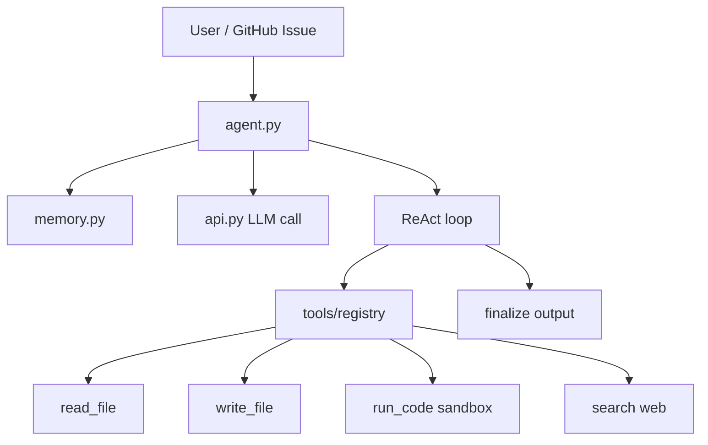

# 10 - Agents

目录：`agents/` — 搜索增强 QA 与完整 Coding Agent。

## 子项目

| 目录 | 能力 | 复杂度 |
|------|------|--------|
| `basic-search-use/` | 联网搜索 + 对话 | 低 |
| `coding-agent/` | ReAct、工具、记忆、沙箱 | 高 |

## basic-search-use/

### 文件

- `chat_search.py` — 主循环：用户问题 → 搜索 → LLM 综合  
- `prompts.py` — 搜索上下文注入模板  

### 与 RAG 区别

| | intro_rag | basic-search-use |
|---|-----------|------------------|
| 知识源 | 固定 QA corpus | 实时 web search |
| 检索 | embedding+rereank | 搜索 API |
| 场景 | eval 对比 | 开放域 QA |

## coding-agent/

**目标**：演示从 **base LLM** 到 **野外自主系统** 的核心逻辑（README），仅使用 sampling API，无 function calling API 依赖。

### 架构



### 核心文件

| 文件 | 职责 |
|------|------|
| `agent.py` | 主 orchestrator：`back_and_forth_with_tools` 循环 |
| `memory.py` | 短期 tool transcript + 长期 global memory |
| `api.py` | Together/Anthropic 统一 completion 接口 |
| `tools/registry.py` | 工具注册与 prompt 片段 |
| `tools/base_tool.py` | Tool 基类 + pydantic I/O |
| `tools/*_tool.py` | 读/写/运行/搜索 |
| `prompts/*.py` | system、tool、sandbox、memory 压缩 prompt |

### ReAct 循环（agent.py）

```python
# 伪代码逻辑
res = api(user_prompt, system_prompt=...)
while contains_tool_calls(res) and '<output>' not in res:
    execute tools → append to memory.local_tool_memory
    res = api(...)  # 继续推理
return finalize(res)  # 清理为 <output>...</output>
```

- 工具调用通过 **文本协议** 解析（非 OpenAI tools API）  
- `MAX_NUM_TOOL_CALLS` 防止死循环  
- `finalize()` 用单独 system prompt 从 messy transcript 抽干净输出  

### Memory（memory.py）

| 类型 | 内容 |
|------|------|
| `local_tool_memory` | 当前任务 tool 交互 transcript |
| `global_mem` | 跨任务压缩摘要（COMPRESS / UPDATE_GLOBAL_MEM prompts） |

区分 **short-term**（工具链上下文）与 **long-term**（项目级记忆）。

### Tools

| Tool | 风险 | 缓解 |
|------|------|------|
| `ReadFileTool` | 读敏感路径 | path 校验 |
| `WriteFileTool` | 覆盖代码 | sandbox 目录 |
| `RunCodeTool` | 任意代码执行 | sandbox + prompt 约束 |
| `SearchTool` | 外网 | Google Custom Search API |

`AGENT_SCRATCH_DIR` 隔离工作区。

### 依赖与环境变量

```bash
pip install together anthropic pydantic

export TOGETHER_API_KEY=...
export GOOGLE_SEARCH_KEY=...
export SEARCH_ENGINE_ID=...
# 可选 GitHub：GITHUB_PAT, GITHUB_USERNAME ...
```

### 运行

```bash
cd agents/coding-agent
python agent.py --verbose
python agent.py --anthropic --verbose
python agent.py --notools   # 消融：无工具
```

| Flag | 模型 |
|------|------|
| 默认 | Llama 3.3 70B |
| `--small` | Llama 3.1 8B |
| `--deepseek` | DeepSeek V3 |
| `--huge` | Llama 3.1 405B |
| `--anthropic` | Claude Sonnet |

### 能力演示

README  claim：可对简单 GitHub issue **端到端提 PR**（需 GitHub token）。

与 `07-业务应用/kefu-kb` 对比：kefu 是 **固定 RAG QA**；coding-agent 是 **工具增强自主任务**。

## 与 LlamaIndex Agent 对照

| | coding-agent | llama_index ReActAgent |
|---|--------------|------------------------|
| Tool 协议 | 自定义 XML/文本 | FunctionTool / Workflow |
| LLM | Together/Anthropic API | 可 OpenAILike 本地 |
| Memory | 手写 compress | ChatMemoryBuffer 等 |
| 定位 | 教学完整 agent 栈 | 框架集成 |

详见 `05-RAG/llama_indexDoc/10-agent-workflow.md`。

## 路线图 TODO（Agents）

- [ ] 多 LLM 社会模拟  
- [ ] Tree-of-Thoughts deep research  
- [ ] Parallel multi-agent research  

## 学习建议

1. 读 `tools/base_tool.py` + `registry.py` — 工具抽象  
2. 读 `agent.py` 中 `back_and_forth_with_tools` — ReAct 控制流  
3. 读 `memory.py` — 上下文压缩策略  
4. 跑 `--verbose` 看 tool call 解析  
5. 对照 `rl/llms/train_grpo_gsm.py` — 未来可用 GRPO 微调 agent 策略（路线图 RLHF/DPO TODO）  

## 安全提示

`RunCodeTool` 与 `WriteFileTool` 在真实部署需 **强沙箱**（容器、seccomp、网络隔离）。本仓库为教学，勿对不可信输入开放。
