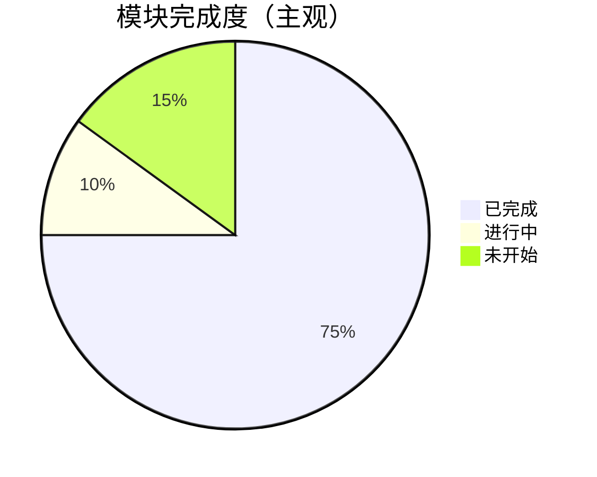

# 11 - 路线图与实现缺口

基于源码根目录 `README.md` checkbox 与各子目录 README 整理。

## 完成度概览

| 模块 | 完成度 | 说明 |
|------|--------|------|
| Architectures | ✅ 100% | 8/8 脚本 |
| Attention notebooks | ✅ 100% | 7/7 |
| Language models | ✅ ~95% | 缺部分 roadmap 项在 mlsys |
| Generative | ✅ ~90% | NeRF TODO |
| RL fundamentals + AC | ✅ 100% | |
| RL LLM | ⚠️ 部分 | GRPO ✅；RLHF/DPO ❌ |
| RL Chess | ⚠️ ~60% | MCTS/env ✅；完整 train ❌ |
| MLSys | ⚠️ ~70% | comms/DDP/TP/kernels ✅；PagedAttn ❌ |
| Evals | ✅ 3/4 | 自定义 eval TODO |
| RAG | ⚠️ 最小 | intro_rag ✅；Graph/Sparse ❌ |
| Agents | ⚠️ 部分 | coding-agent ✅；ToT/multi-agent ❌ |

## 按类别详细清单

### Architectures — 全部完成

- [x] Transformer（language-models/）
- [x] ViT, DiT, RNN, LSTM, ResNet, MLP-Mixer, MoE*, Mamba*

### Attention — 全部完成

- [x] Vanilla, MHSA, GQA, Linear*, Sparse, Cross, MLA*

### Language Models

- [x] DataLoader v0/v1/v2, BPE, KV Cache, Speculative Decoding, RoPE*, MTP
- [ ] （MLSys 侧）Ring Attention, Paged Attention, Continuous Batching

### Reinforcement Learning

**Deep RL — 完成**

- [x] DQN, REINFORCE, PPO
- [x] A2C, A3C, IMPALA*, DDPG, SAC*
- [x] MPC, Expert Iteration (MCTS)

**Chess / AlphaZero — 进行中**

- [x] `model.py`, `env.py`, `MCTS.py`, `buffer.py`, tests
- [x] `train.py` 骨架
- [ ] 完整训练环、随机 bot 评估、Elo
- [ ] 性能：dynamic batching、多进程 MCTS
- [ ] 目标：H100 过夜训练能赢作者

**LLM RL**

- [x] GRPO GSM8K, GRPO humor
- [ ] RLHF + UltraFeedback
- [ ] DPO + UltraFeedback

### Generative Models

- [x] GAN, Pix2Pix, VAE, Autoencoder, DDPM*, CFG, Flow Matching
- [ ] NeRF

### MLSys

- [x] comms*, DDP, TP*, 7× Triton kernels
- [ ] FlashAttention Forward
- [ ] Ring / Paged / Continuous batching

### Evals

- [x] GSM8K, MMLU, SimpleQA
- [ ] BERT SST-2
- [ ] 自定义 eval

### RAG

- [x] intro_rag.py
- [ ] 训练 small embedding/reranker
- [ ] Multi-hop, Sparse+Ddense, Graph RAG

### Agents

- [x] basic-search-use
- [x] coding-agent（tools, ReAct, memory, sandbox）
- [ ] LLM 社会模拟
- [ ] Tree-of-Thoughts research
- [ ] Parallel multi-agent research

## 与本仓库文档的衔接

| beyond-nanogpt 缺口 | 本仓库可补充 |
|-------------------|--------------|
| Paged Attention | `03-推理部署/llama.cppDoc/16-KV-Cache与Memory系统.md` |
| Continuous Batching | `llama.cppDoc/17-Batch与Micro-batch.md` |
| 生产 RAG | `05-RAG/llama_indexDoc/` |
| 3D 并行 | `06-Research/Megatron-LM/` |
| 量化 kernel | `04-量化内核/ggmlDoc/` |

## 建议贡献/自学顺序（填缺口）

1. **Chess train.py** — 串联已有 MCTS + buffer（项目内最大未完成块）
2. **FlashAttention Triton** — 连接 kernels/ 与 attention notebooks
3. **DPO/RLHF** — 与 LLaMA-Factory、GRPO 对照实现
4. **Paged Attention notebook** — 对照 vLLM 论文 + llama.cppDoc

## 版本与维护

- 上游持续更新 roadmap checkbox
- 本 `beyond-nanogptDoc` 以仓库内 **当前 snapshot** 为准
- 星标 * 表示作者标注 tricky 的实现，优先精读
