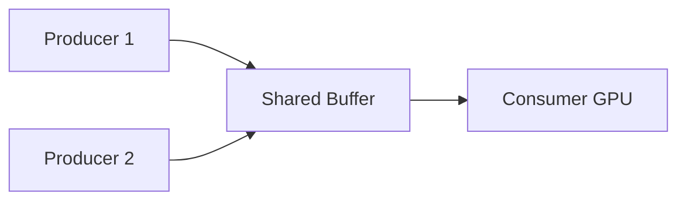

# 12 - 工程经验（LESSONS 精华）

浓缩自源码根目录 `LESSONS.md` — 作者手写 **>10k 行 PyTorch** 后的总结，并与本仓库各模块交叉引用。

## 目标函数优先

> The objective function is paramount.

- 架构、数据常受关注，但 **seminal 工作往往是新目标函数**（尤其生成式：score matching、flow、对抗损失）。
- LLM 预训练看似只有 next-token，但 **RL 阶段 reward shaping = 目标设计**。
- 读 `generative-models/train_ddpm.py` 文件头：DPM → DDPM 等价性源于 **去噪目标 ≡ score**。

**对应模块**：06-generative-models、07-RL/GRPO

## CPU vs GPU 内存模型

- CPU：`multiprocessing` 易用，**共享内存空间**。
- GPU：**独立显存**，跨卡通信贵；`dist.send/recv` 需防 deadlock（见 `mlsys/comms.py`）。

**模式**：大对象放 `torch.share_memory_()`，队列只传 **index/slot**（DataLoader v2、IMPALA）。

## PyTorch 性能习惯

| 习惯 | 原因 | 示例位置 |
|------|------|----------|
| 预分配 + index | 避免重复 alloc | dataloader2 ring buffer |
| 少 `torch.tensor(x)` | 拷贝开销 | LESSONS 全文 |
| 原生算子替 loop | 10× 常见 | conv as unfold+bmm |
| 广播索引 | 省内存 | `logits[b_idx, s_idx, classes]` |
| 表达式等价变换 | conv ↔ matmul | train_ddpm Conv |

## 广播技巧（分类 logits）

`logits` 形状 `[b,s,t]`，`classes` 形状 `[b,s]`：

```python
logits[torch.arange(b)[:, None], torch.arange(s), classes]
```

优于 loop 或 materialize 巨大 index tensor。

## 训练「难点」在 normalization + residual

- LayerNorm/BatchNorm/残差不是细节，是 **使深层可训** 的突破。
- 2012 前共识认为复杂非线性不可训 — 实为 **工程问题**。

**对应**：`transformer.py` 手写 LN；ResNet/ViT 脚本。

## 数学深度：LLM 之外更广

- RL 论文：loss landscape、Hessian、natural gradient、proper scoring。
- 生成模型：最优传输、probability flow ODE、score ↔ 分布。
- LLM 主线相对单一（next-token + 小变体），Research 需补 **概率/优化/信号处理**（Mamba 离散化即 ODE/ZOH）。

## 消费者-生产者模式（横切）



| 出现位置 | Producer | Consumer |
|----------|----------|----------|
| dataloader2 | CPU tokenize | GPU train |
| IMPALA | CPU rollout | GPU PPO-style update |
| async RAG eval | asyncio API | 汇总 metrics |

**启示**：写会 DataLoader 后 IMPALA 「很容易」— 同一系统设计。

## Loss 不必单调下降

| 场景 | 现象 |
|------|------|
| CartPole PPO | reward↑ 时 loss 可能↑（episode 变长） |
| GAN | D/G 对抗导致对方 loss 变差 |
| DDPG | Actor/Critic 耦合 |

**不要**只用 loss 曲线判断 RL 好坏，看 **reward/ eval**。

## 探索策略各异

- DQN：ε-greedy 衰减
- DDPG：动作空间加噪声
- Policy gradient：entropy bonus

LLM RL 长 horizon agent 需重新理解 **on/off-policy**（pretrain 的 off-policy「能用」不保证 agent 任务）。

## 代码有时比公式清晰

Reparameterization：`z = mean + std * ε`，对 mean/std 反传 — 公式抽象，代码一行。

## 推荐阅读顺序（LESSONS + 代码）

1. 读 `LESSONS.md` 全文（~50 行，高密度）
2. 对照 `language-models/dataloaders/dataloader2.py`
3. 对照 `rl/actor-critic/train_impala.py`
4. 对照 `architectures/train_moe.py` scatter/gather
5. 对照 `mlsys/train_ddp.py` bucket hook

## 作者学习法（README）

1. **读** 注释与实现  
2. **改** 超参 hack  
3. **从零重写** 再对比  
4. `--wandb` 验证行为  

与本仓库 `01-模型原理/nanoGPT` 一脉相承，但 breadth 更大。
